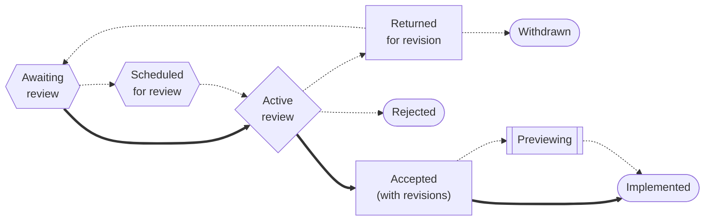

# Swift Evolution Process

Swift is a powerful and intuitive programming language that is designed to make writing and maintaining correct programs easier.
Swift is growing and evolving, guided by a community-driven process referred to as the Swift evolution process.
This document outlines the Swift evolution process and how a feature grows from a rough idea into something that can improve the Swift development experience for millions of programmers.

## Scope

The Swift evolution process applies to all design changes to specific aspects of the Swift project.
This includes the Swift language, its standard library and certain other core libraries, and the interfaces of core tools such as the Swift package manager.
The complete list is given [below](#evolution-areas).

The evolution process applies only to the design of features.
Neither the implementation of the feature nor the user documentation for it require evolution review.
Implementation and documentation work in the Swift project is open-source and subject to the normal code review process; see [Contributing to Swift](https://www.swift.org/contributing/).
Changes such as bug fixes, optimizations, and diagnostic improvements can be contributed at any time.
Implementation review is generally completely independent from the design review performed by the Swift evolution process.
However, there is one important exception: patches that would change a design covered by the evolution process should not be merged without the approval of the appropriate evolution workgroup.
This may include fixing bugs, if the bug allows additional things to be expressed or changes the user-visible behavior of a feature.
Bugs in features that have not yet been officially released can be freely fixed.
Implementors should check with the appropriate evolution workgroup if they're uncertain what to do.

The evolution process does not cover the design of experimental features, which can be added, changed, or removed at any time using the normal code review process.
Implementations should take steps to prevent the accidental use of experimental features, such as by enabling them only when an explicitly experimental command line flag is passed to the tool.
Features should not be allowed to remain perpetually experimental; a feature with no clear path for development into an official feature should be removed.

The evolution process does not cover everything that is important for writing Swift code.
The design of tools such as IDEs, debuggers, profilers, and documentation generators is outside of the scope of the evolution process.
The Core Team may empower workgroups to guide or offer recommendations for the development of these tools, but that guidance is not reviewed, and recommendations for tools developed outside of the Swift project are not binding.

## Goals

The Swift evolution process aims to leverage the collective ideas, insights, and experience of the Swift community to improve the Swift development experience.
Its two primary goals are:

* Engage the wider Swift community in the ongoing evolution of Swift, and
* Maintain the vision and conceptual coherence of Swift.

There is a natural tension between these two goals.
Open evolution processes are, by nature, chaotic.
Yet, maintaining a coherent vision for something as complicated as a programming language requires some level of coordination.
The Swift evolution process aims to strike a balance that best serves the Swift community as a whole.

## Evolution workgroups

The [Core Team](https://www.swift.org/community/#core-team) is responsible for the strategic direction of Swift.
As part of this, it identifies areas of the Swift project that should be covered by the evolution process.
Anything not so identified is not covered by the evolution process.

The Core Team may elect to delegate evolution authority over a specific area to a particular [steering group or workgroup](https://www.swift.org/community/).
Otherwise, that evolution authority remains with the Core Team. The group that exercises evolution authority over an area is called its *evolution workgroup*.

Evolution workgroups are responsible for deciding the details of how the evolution process applies to their evolution areas, within the guidelines laid out in the following section.
If a proposal touches on multiple evolution areas, all affected evolution workgroups work together to decide and carry out the details of the evolution process for the proposal.

Steering groups and the Core Team oversee the evolution decisions of any evolution workgroups organized beneath them.
They review any substantial changes to the review process and have the right to override evolution decisions as they see fit.

## Evolution review

The evolution process consists of two key steps:

1. the creation of a *proposal document* that describes the proposal, usually developed and discussed in a [forums thread][forums] called a *pitch*; and

2. an *open review* of the proposal by the community at large, after which the evolution workgroup decides what to do with it.

Every substantial design change in an area covered by the evolution process must go through these two steps and be accepted by the appropriate evolution workgroup before it can be released.

Evolution workgroups may decide that a [change is minor enough to not need review](#summary-acceptance). They may also [reject a proposal without review](#summary-rejection).

The exact details of the review process are decided by the appropriate evolution workgroup for an evolution area.
However, there is a baseline expectation of what constitutes a proper review for all parts of the Swift project.

Currently, all evolution areas use *full evolution review* for all proposals.
In this process, the pitch and open review are separate and explicit steps.
The proposal is developed in a pitch thread until the author is satisfied with it and the workgroup believes it is ready for review.
The workgroup then creates a new thread for the open review of that specific version of the proposal.
After the review is complete, the workgroup either decides to accept it, reject it, or ask for revisions.
If the proposal is revised in a substantially new way that has not been adequately discussed, the revised proposal must then undergo another round of open review.
This may continue until the workgroup is ready to make a final decision.

The review process for an evolution area is described in the [Evolution Areas](#evolution-areas) section below.
This includes:
- where pitches and open reviews are conducted on the [forums][forums] and
- any additional requirements that proposals must satisfy to be considered.

Substantial changes to the review process for an evolution area must be approved by the Core Team or (if applicable) the steering group that has oversight over the workgroup.
This document should also be updated to reflect the changes, and workgroups are encouraged to propose them as a PR.

### Summary acceptance

Evolution workgroups may decide that certain design changes are sufficiently obvious to accept without a proposal document or open review.
This is generally only appropriate for small adjustments to recently-accepted proposals where the workgroup feels that there is no reasonable objection or alternative to the proposed change.
Examples include:

- adding a method to a particular type which was overlooked in a proposal that added that method to several similar types;

- forbidding an unsafe or nonsensical use of a new feature; or

- gating a change behind an upcoming feature flag after it was discovered to cause significant source-compatibility problems.

Such changes should still generally be announced in the release notes when they are made.
Evolution workgroups should be circumspect about approving changes this way, and in close cases, they should err on the side of conducting a normal review.

### Summary rejection

Evolution workgroups may also reject proposals without review if the workgroup believes that there's no possibility that further development or review of the proposal would lead to it being accepted.
This should only be done when there's consensus within the workgroup, but it can be appropriate if, for example, the workgroup feels that the proposal is simply out of keeping with its overall design direction for the evolution area.
The workgroup should clearly communicate its decision and the reasons why in any threads discussing the proposal.

## Participation

Everyone in the Swift community is welcome to propose, discuss, and review ideas in any evolution area.

### Reviewing a proposal

You can provide feedback on a proposal in either the pitch phase or open review.
If you have limited time to participate in Swift evolution, you should focus on reading and providing feedback on proposals during their open review.

To participate in proposal review, you watch for proposal review threads in the appropriate section of the [forums][].
The forums software allows you to receive notifications whenever a thread is created in a specific category: click on the category, then click on the bell icon in the upper right to see your options.
You can also configure the forums to send you these notifications by email if you'd like.

You should make an effort to read and understand the proposal document before providing feedback.
However, you do not have to have read the review thread, and it's okay to leave the same feedback as someone else.
The evolution workgroup may provide specific guidance about what they're looking for in review feedback, but in general, good feedback includes things like:

  - asking for clarification about what the document is trying to say
  - evaluations of specific aspects of the proposal, rather than just broad sentiments
  - examples of how you'd actually use the proposed change / how you don't think you'd be able to use it

You can leave review feedback either publicly, by making a reply in the review thread, or privately, by sending a message directly to the review manager as laid out in the initial post of the review thread.
If you leave feedback publicly, other community members may respond to you, but you are not obliged to engage with them; it's fine to leave your feedback and move on.
In either case, the review manager may ask you for clarification so that they can more accurately represent your opinion to the rest of the workgroup.

Please understand that open review is not a vote.
The evolution workgroup is going to make a decision using its judgment of what's best for the project based on the information it has available to it.
Simple statements of being for or against a proposal doesn't typically add much to the conversation.
In contrast, a detailed argument that you don't think you'll be able to use the proposal because of a specific technical flaw is much more likely to be convincing.

To participate in the pitch phase, you watch for pitch threads in the appropriate section of the [forums][].
Pitch discussions are usually informal, open-ended discussions about the problem at hand and how the author is trying to solve it.
Participating in a pitch thread can be a very powerful way of shaping the idea before it ever proceeds to review, but it can also require a much more substantial time commitment.
Good pitch feedback includes anything that would be appropriate as review feedback (above), plus:

  - evaluations of alternative approaches that you've used
  - suggestions for how to improve the proposal document (if the author's started writing one)

### Making a proposal

The exact details of making a proposal may vary between evolution areas; read the [descriptions of the different areas](#evolution-areas) for more information.

1. You should start by checking to see if your idea's already being discussed.
   The [Swift forums][forums] have a search function that you can use to look for existing threads.
   Some evolution areas also maintain a list of commonly rejected proposals, which you can find linked from the appropriate section of this document.
   If the idea has come up before, but it hasn't been rejected, the discussion died down a long time ago, and you think you have something new to add, you are welcome to start a new pitch.

2. You *pitch* an idea by creating a thread to discuss it in a specific section of the forums.
   This is usually an informal, open-ended discussion about the problem you're trying to solve and your ideas about how to solve it.
   You do not need to have written a formal proposal at this point.
   If your search found any relevant prior threads, please link to them in your new pitch.

3. When you've developed a solid idea of what you want to propose, you write a formal *proposal document*.
   You should follow the appropriate template document for the evolution area you're working in.
   The template may describe additional requirements, like having a prototype implementation ready; this varies from area to area.
   Be sure to update the pitch thread whenever you make significant changes to the proposal.

4. You signal that you think your proposal is ready for review by creating a non-[draft][draft-pr] pull request to add it to the appropriate directory in the [evolution repository][swift-evolution-repo].

5. The evolution workgroup will appoint a *review manager* to oversee your proposal.
   The review manager should get in touch within a few weeks to relay any additional feedback from the workgroup.
   When they agree that your proposal is ready, they'll create a dedicated thread for the open review in the appropriate section of the forums.
   This thread will be kept open for a period of at least ten days, covering at minimum two consecutive weekends.
   If you need to make revisions to your proposal during the review, the review period may need to be extended to give adequate review time to the change.

6. After the review period ends, the evolution workgroup will decide what to do with your proposal.
   Possible outcomes include accepting it, outright rejecting it, or asking you to revise it, with the expectation of putting the revised proposal through another round of pitch or review.

As a proposal author, you have a responsibility to try to respond to questions during the pitch and open review.
Especially during the pitch phase, keep in mind that questions about your proposal often identify places where you can improve your proposal document to be clearer.

You should also try to engage with feedback and make an effort to understand other people's criticisms.
If they've identified a real flaw, you should thank them and revise the proposal accordingly.
If they're misunderstanding your proposal, you can probably improve the document to clarify the point of confusion.
If, after a reasonable discussion, you find that you simply disagree with them about the design, that's okay.
Your objective should be to make the best case for your proposal that you can, both to the community at large and to the evolution workgroup.
If the workgroup agrees with your side of the argument, they will accept your proposal even if you haven't achieved perfect consensus in the community.
You may find it helpful, however, to write up the disagreement in the proposal document, perhaps as part of the motivation or in the Alternatives Considered section.

Ultimately, open review is not a vote.
The role of evolution reviewers is to provide feedback on the proposal, including arguments for or against it.
The evolution workgroup will then consider these arguments and decide what is best for the Swift project.
Neither the raw number of people making arguments on either side, nor the ferocity of their arguments, is a meaningful input to that decision.

## Proposals, roadmaps, and visions

There are three kinds of documents commonly used in the evolution process.

* An evolution *proposal* describes a specific proposed change in detail.
  All substantial design changes are advanced as proposals which will be discussed in the community and given a formal open review.

* An evolution *roadmap* describes a concrete plan for how a complex change will be broken into separate proposals that can be individually pitched and reviewed.
  Considering large changes in small pieces allows the community to provide more focused feedback about each part of the change.
  A roadmap makes this organization easier for community members to understand.

  Roadmaps are planning documents that do not need to be reviewed.

* An evolution *vision* describes a high-level design for a broad topic (for example, string processing or concurrency).
  A vision creates a baseline of understanding in the community for future conversations on that topic, setting goals and laying out a possible program of work.

  Visions must be approved by the appropriate evolution workgroup. This approval is an endorsement of the vision's basic ideas, but not of any of its concrete proposals, which must still be separately developed and reviewed.

## Evolution areas

### Language and standard library evolution

The [Language Steering Group][language-steering-group] has authority over:
- the features of the Swift language,
- the public interface of the Swift standard library,
- the language configuration options of the Swift compiler, and
- the language configuration options of [Swift package manager][spm] manifest files.

Language and standard library proposals use full evolution review.
They are pitched in the [Evolution > Pitches][forums-pitches] section of the Swift forums and reviewed in the [Evolution > Proposal Reviews][forums-reviews] section.

The LSG requires language and standard library proposals to have a prototype implementation before they can be reviewed.
This implementation doesn't have to be fully professional and ready to release, but it at least has to be a viable proof of concept and in a state that can be used by reviewers.

Language and standard library proposal documents should use the [Swift proposal template](proposal-templates/0000-swift-template.md).
They use the "SE" prefix and can be found in the [`proposals` directory](proposals/) of the Swift evolution repository.

The LSG maintains a list of [commonly rejected proposals](commonly_proposed.md).

### Package manager evolution

The [Ecosystem Steering Group][ecosystem-steering-group] has authority over all aspects of the [Swift package manager][spm] and its manifest files except language configuration.

Package manager proposals use full evolution review.
Proposals are pitched in the [Evolution > Pitches][forums-pitches] section of the Swift forums and reviewed in the [Evolution > Proposal Reviews][forums-reviews] section.

Package manager proposal documents should be based on the [package manager proposal template](proposal-templates/0000-swiftpm-template.md).
For historical reasons, they also use the "SE" prefix and can be found in the [`proposals` directory](proposals/) of the Swift evolution repository.

### Testing evolution

The [Testing Workgroup][testing-workgroup] has authority over the evolution of the [Swift Testing](https://github.com/swiftlang/swift-testing) and [Corelibs XCTest](https://github.com/swiftlang/swift-corelibs-xctest) projects.

Testing proposals use full evolution review.
They are pitched in the [Evolution > Pitches][forums-pitches] section of the Swift forums and reviewed in the [Evolution > Proposal Reviews][forums-reviews] section.

Testing proposals should use the [testing proposal template](proposal-templates/0000-swift-testing-template.md).
They use the "ST" prefix and can be found in the [`proposals/testing` directory](proposals/testing/) of the Swift evolution repository.

## Focus areas for Swift releases

Each major Swift release is focused on a [specific set of goals](README.md) described early in the release cycle.
These focus areas don't necessarily mean that unrelated proposals won't be considered, but if the evolution workgroup decides that your proposal doesn't fit with the focus areas of the current release, they may ask you to hold it until a later release.

If you are worried that an idea might out of scope for the current release, please contact a representative of the appropriate evolution workgroup for guidance.

<details>
<summary>Information mostly of interest to evolution workgroups</summary>

## Proposal documents

Proposal documents should generally not be renamed once they've been added to the repository.
It's okay to change the name of the proposal in the text, but the filename should remain stable.

To simplify automated "scraping" of proposal documents, all proposal documents (and therefore proposal templates) should start with the following basic structure and use standard fields:

```text
# Name of proposal

* Field1: value
* Field2: value

The remainder of the document has no specific requirements.
```

Standard fields include:
* `Proposal`:
  exactly `[prefix-number](filename.md)`, where `prefix` is the appropriate document prefix (such as `SE` for language and SPM proposals), `number` is the sequence number of this proposal within that prefix, and `filename.md` is the filename of this proposal document.
  Required in all proposal documents.
* `Author` or `Authors`:
  a comma-separated list of authors.
  Required in all proposal documents.
  Usually, author names will link to their github profiles, but that is not required.
  The plural name `Authors` should be used if and only if there are multiple authors in the list.
  Authors should only list other people as co-authors with their explicit consent.
* `Review Manager` or `Review Managers`:
  a comma-separated list of review managers.
  Required in all proposal documents that use full evolution review.
  Usually, these will be links to their github profiles, but that is not required.
  The plural name `Review Managers` should be used if and only if there are multiple review managers in the list.
* `Status`:
  one of the [proposal states](#proposal-states), bolded using `**`.
  Required in all proposal documents.
* `Vision`:
  a link to a vision document which encompasses this proposal.
  Optional.
* `Roadmap`:
  a link to a roadmap document or thread which encompasses this proposal.
  Optional.
* `Bug`:
  a link to a bug related to this proposal.
  Optional.
* `Implementation`:
  a comma-separated list of links to implementation pull requests for this proposal.
  Optional.
* `Previous Proposal`:
  a link to a previous proposal (with a different document number) addressing the same idea.
  This field is rare because proposals are usually revised rather than replaced.
  Optional.
* `Previous Revision` or `Previous Revisions`:
  a space-separated list of permalinks to previous revisions of this proposal document.
  Optional.
  The link text should be a number, starting with 1.
  Only "official" revisions need to be listed, such as those used for different open reviews.
  The plural name `Previous Revisions` should be used if and only if there are multiple revisions in the list.
  Usually, there will be a previous revision for each additional review in the `Review` field, but sometimes multiple reviews are conducted on the same text in order to focus on different aspects of the proposal.
* `Review`:
  a space-separated list of parenthesized links to different forums threads about this proposal.
  Link text can be free-form but is encouraged to match the [standard grammar](#standard-review-links) whenever applicable.
  Required in all new proposal documents.

These standard fields should be provided in this order. Other fields can be added between `Status` and `Review`.

The following header fields are used only in specific evolution areas:

* `Upcoming Feature Flag`: an identifier in backticks.
  Used for language proposals where some or all of the content in the proposal is enabled only when a particular upcoming feature is enabled.

## Proposal states



A given proposal can be in one of several states:

* **Awaiting review**:
  The proposal is awaiting review.
  Once known, the dates for the actual review will be placed in the proposal document.
  When the review period begins, the review manager will update the state to *Active review*.
* **Scheduled for review (...)**:
  The public review of the proposal in the [Swift forums][proposal-reviews]
  has been scheduled for the specified date range.
* **Active review (...)**:
  The proposal is undergoing public review in the [Swift forums][proposal-reviews].
  The review will continue through the specified date range.
* **Returned for revision**:
  The proposal has been returned from review for additional revision to the current draft.
* **Withdrawn**:
  The proposal has been withdrawn by the original submitter.
* **Rejected**:
  The proposal has been considered and rejected.
* **Accepted**:
  The proposal has been accepted and is either awaiting implementation or is actively being implemented.
* **Accepted with revisions**:
  The proposal has been accepted, contingent upon the inclusion of one or more revisions.
* **Previewing**:
  The proposal has been accepted and is available for preview in the [Standard Library Preview package][preview-package].
* **Implemented (Swift X.Y)**:
  The proposal has been implemented (for the specified version of Swift).
  If the proposal's implementation spans multiple version numbers, write the version number for which the implementation will be complete.

## Standard review links

While links in the `Review:` header field can have any text, they are encouraged to use standardized text matching the following grammar whenever that describes the target of the link with sufficient clarity:

```text
review-label:
  ordinal? standard-review-label

# An ordinal should be provided if and only if there are multiple
# links of the same kind in the review field.
ordinal:
  'first'
  'second'
  'third'
  'fourth'
  ...

standard-review-label:
  'pitch'
  'review'
  'revision'
  'acceptance' ('with' 'modifications')?
  'rejection'
  'returned for revision'
```

This grammar assumes a single space between adjacent tokens.

## Review announcement

When a proposal enters full evolution review, a new topic will be posted to the appropriate section of the Swift forums using the appropriate announcement template below.

---

<details>
<summary>Language and standard library</summary>

Hello Swift community,

The review of "\<\<PROPOSAL NAME>>" begins now and runs through \<\<REVIEW END DATE>>. The proposal is available here:

> https://linkToProposal

Reviews are an important part of the Swift evolution process.
All review feedback should be either on this forum thread or, if you would like to keep your feedback private, directly to the review manager.
When emailing the review manager directly, please keep the proposal link at the top of the message.

##### Trying it out

If you'd like to try this proposal out, you can [download a toolchain supporting it here]().
You will need to add `-enable-experimental-feature FLAGNAME` to your build flags.
\<\<Review managers should revise this section as necessary, or they can delete it if a toolchain is considered unnecessary for this proposal.\>\>

##### What goes into a review?

The goal of the review process is to improve the proposal under review through constructive criticism and, eventually, determine the direction of Swift.
When writing your review, here are some questions you might want to answer in your review:

* What is your evaluation of the proposal?
* Is the problem being addressed significant enough to warrant a change to Swift?
* Does this proposal fit well with the feel and direction of Swift?
* If you have used other languages or libraries with a similar feature, how do you feel that this proposal compares to those?
* How much effort did you put into your review? A glance, a quick reading, or an in-depth study?

More information about the Swift evolution process is available at

> <https://github.com/swiftlang/swift-evolution/blob/main/process.md>

Thank you,

\<\<REVIEW MANAGER NAME>>

Review Manager

</details>

<details>
<summary>Testing</summary>

Hello Swift community,

The review of "\<\<PROPOSAL NAME>>" begins now and runs through \<\<REVIEW END DATE>>.
The proposal is available here:

> https://linkToProposal

Reviews are an important part of the Swift evolution process.
All review feedback should be either on this forum thread or, if you would like to keep your feedback private, directly to the review manager.
When emailing the review manager directly, please keep the proposal link at the top of the message.

##### Trying it out

To try this feature out, add a dependency to the `main` branch of `swift-testing` to your package:

```swift
dependencies: [
  ...
  .package(url: "https://github.com/swiftlang/swift-testing.git", branch: "main"),
]
```

Then, add a target dependency to your test target:

```swift
.testTarget(
  ...
  dependencies: [
    ...
    .product(name: "Testing", package: "swift-testing"),
  ]
```

Finally, import Swift Testing using `@_spi(Experimental) import Testing`.

##### What goes into a review?

The goal of the review process is to improve the proposal under review through constructive criticism and, eventually, determine the direction of Swift.
When writing your review, here are some questions you might want to answer in your review:

* What is your evaluation of the proposal?
* Is the problem being addressed significant enough to warrant a change to Swift Testing?
* Does this proposal fit well with the feel and direction of Swift Testing?
* If you have used other languages or libraries with a similar feature, how do you feel that this proposal compares to those?
* How much effort did you put into your review?
  A glance, a quick reading, or an in-depth study?

More information about the Swift evolution process is available at

> https://github.com/swiftlang/swift-evolution/blob/main/process.md

Thank you,

\<\<REVIEW MANAGER NAME>>

Review Manager

</details>

</details>

[forums]: https://forums.swift.org/
[forums-pitches]: https://forums.swift.org/c/evolution/pitches/5
[forums-reviews]: https://forums.swift.org/c/evolution/proposal-reviews/21
[forums-notifications]: https://meta.discourse.org/t/understanding-the-notifications-menu-in-discourse/3059
[spm]: https://www.swift.org/package-manager/
[swift-evolution-repo]: https://github.com/swiftlang/swift-evolution  "Swift evolution repository"
[swift-evolution-staging]: https://github.com/swiftlang/swift-evolution-staging  "Swift evolution staging repository"
[proposal-reviews]: https://forums.swift.org/c/evolution/proposal-reviews "'Proposal reviews' subcategory of the Swift forums"
[status-page]: https://www.swift.org/swift-evolution
[preview-package]: https://github.com/apple/swift-standard-library-preview/
[language-steering-group]: https://www.swift.org/language-steering-group
[platform-steering-group]: https://www.swift.org/platform-steering-group
[ecosystem-steering-group]: https://www.swift.org/ecosystem-steering-group
[testing-workgroup]: https://www.swift.org/testing-workgroup  "Testing Workgroup page on Swift.org"
[swift-template]: proposal-templates/0000-swift-template.md  "Swift proposal template"
[swiftpm-template]: proposal-templates/0000-swiftpm-template.md  "Swift Package Manager proposal template"
[swift-testing-template]: proposal-templates/0000-swift-testing-template.md  "Swift Testing proposal template"
[draft-pr]: https://docs.github.com/en/pull-requests/collaborating-with-pull-requests/proposing-changes-to-your-work-with-pull-requests/about-pull-requests#draft-pull-requests
