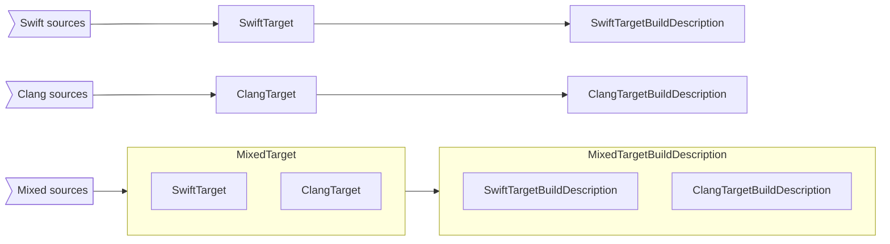

# Package Manager Mixed Language Target Support

* Proposal: [SE-0403](0403-swiftpm-mixed-language-targets.md)
* Authors: [Nick Cooke](https://github.com/ncooke3)
* Review Manager: [Saleem Abdulrasool](https://github.com/compnerd)
* Status: **Scheduled for review (July 17, 2023...July 28, 2023)**
* Implementation: [apple/swift-package-manager#5919](https://github.com/apple/swift-package-manager/pull/5919)
* Decision Notes: [Pitch](https://forums.swift.org/t/61564)

## Introduction

This is a proposal for adding package manager support for targets containing
both Swift and [C based language sources][SE-0038] (henceforth, referred to as
mixed language sources). Currently, a target’s source can be either Swift or a
C based language ([SE-0038]), but not both.

Swift-evolution thread: [Discussion thread topic for that
proposal](https://forums.swift.org/)

## Motivation

This proposal enables Swift Package Manager support for multi-language targets.

Packages may need to contain mixed language sources for both legacy or
technical reasons. For developers building or maintaining packages with mixed
languages (e.g. Swift and Objective-C), there are two workarounds for doing so
with Swift Package Manager, but they have drawbacks that degrade the developer
experience, and sometimes are not even an option:
- Distribute binary frameworks via binary targets. Drawbacks include that the
  package will be less portable as it can only support platforms that the
  binaries support, binary dependencies are only available on Apple platforms,
  customers cannot view or easily debug the source in their project workspace,
  and tooling is required to generate the binaries for release.
- Separate a target’s implementation into sub-targets based on language type,
  adding dependencies where necessary. For example, a target `Foo` may have
  Swift-only sources that can call into an underlying target `FooObjc` that
  contains Clang-only sources. Drawbacks include needing to depend on the
  public API surfaces between the targets, increasing the complexity of the
  package’s manifest and organization for both maintainers and clients, and
  preventing package developers from incrementally migrating internal
  implementation from one language to another (e.g. Objective-C to Swift) since
  there is still a separation across targets based on language.

Package manager support for mixed language targets addresses both of the above
drawbacks by enabling developers to mix sources of supported languages within a
single target without complicating their package’s structure or developer
experience.

## Proposed solution

Package authors can create a mixed target by mixing language sources in their
target's source directory. When mixing some languages, like C++, authors have
the option of opting in to advanced interoperability features by configuring
the target with an interoperability mode [`SwiftSetting.InteroperabilityMode`].

When building a mixed language target, the package manager will build the
public API into a single module for use by clients.

At a high level, the build process is split into two parts based on
the language of the sources. The Swift sources are built by the Swift compiler
and the C/Objective-C/C++ sources are built by the Clang compiler.

1. The Swift compiler is made aware of the Clang part of the package when
   building the Swift sources into a `swiftmodule`.
1. The Clang part of the package is built with knowledge of the
   interoperability Swift header. The contents of this header will vary
   depending on if/what language-specific interoperability mode is configured
   on the target. The interoperability header is modularized as part of the
   mixed target's public interface.


The [following example][mixed-package] defines a package containing mixed
language sources.

```
MixedPackage
├── Package.swift
├── Sources
│   └── MixedPackage
│       ├── Jedi.swift          ⎤-- Swift sources
│       ├── Lightsaber.swift    ⎦
│       ├── Sith.m              ⎤-- Implementations & internal headers
│       ├── SithRegistry.h      ⎟
│       ├── SithRegistry.m      ⎟
│       ├── droid_debug.c       ⎦
│       ├── hello_there.txt     ]-- Resources
│       └── include             ⎤-- Public headers
│           ├── MixedPackage.h  ⎟
│           ├── Sith.h          ⎟
│           └── droid_debug.h   ⎦
└── Tests
    └── MixedPackageTests
        ├── JediTests.swift     ]-- Swift tests
        ├── SithTests.m         ]-- Objective-C tests
        ├── ObjcTestConstants.h ⎤-- Mixed language test utils
        ├── ObjcTestConstants.m ⎟
        └── TestConstants.swift ⎦
```

The proposed solution would enable the above package to do the following:
1. Export the public API from across the mixed language sources.
1. Use C/Objective-C/C++ compatible Swift API from target’s Swift sources
   within the target’s C/Objective-C/C++ sources.
1. Use Swift compatible C/Objective-C/C++ API from target’s C/Objective-C/C++
   sources within the target’s Swift sources.
1. Access target resources from Swift and Objective-C contexts.

### Limitations

Initial support for targets containing mixed language sources will have the
following requirements:
1. The target must be either a library or test target. Support for other types
   of targets is deferred until the use cases become clear.
1. The target must be built on a Mac. This is because the Swift
   compiler-generated Objective-C compatibility header is only generated on
   macOS.

### Importing a mixed target

Mixed targets can be imported into a client target in several ways. The
following examples will reference `MixedPackage`, a package containing mixed
language target(s).

#### Importing within a **Swift** context

The public API of a mixed target, `MixedPackage`, can be imported into a
**Swift** file via an `import` statement:

```swift
// MyClientTarget.swift

import MixedPackage
```

Testing targets can import the mixed target via
`@testable import MixedPackage`. As expected, this will expose internal Swift
types within the module. It will not expose any non-public C language types.

#### Importing within an **C/Objective-C/C++** context

How a mixed target, `MixedPackage`, is imported into an **C/Objective-C/C++**
file will vary dependong on the language it is being imported in.

When Clang modules are supported, clients can import the module. Textual
imports are also an option.

**Note that the C/Objective-C/C++ compatible Swift API is only available via
textually importing the generated Swift header.**

For this example, consider `MixedPackage` being organized as such:

```
MixedPackage
├── Package.swift
└── Sources
     ├── NewCar.swift
     └── include                  ]-- Public headers directory
        ├── MixedPackage
        │   ├── OldCar.h
        │   └── MixedPackage.h    ⎤-- These headers are generated
        └── MixedPackage-Swift.h  ⎦   by the package manager and
                                      virtually overlayed
                                      within the package's public
                                      headers directory. More
                                      details in the Detailed
                                      Design section. *
```

\* The generated interop header (`$(TARGET_NAME)-Swift.h`) is always
generated for a mixed target (even when there is no Objective-C compatible
Swift API). On the other hand, the umbrella header located at
`$(PUBLIC_HDRS_DIR)/$(TARGET_NAME)/$(TARGET_NAME).h` is only generated when
the mixed target does not contain an umbrella header at that path. It imports
all Objective-C/C headers and acts as the bridging header used in the generated
interop header.

`MixedPackage`'s public headers directory (`include`) is added a header
search path to client targets. The following example demonstrates all the
possible public headers that can be imported from `MixedPackage`.

```objc
// MyClientTarget.m

// Import the public non-Swift API if module imports are supported.
@import MixedPackage;
// Imports types defined in `OldCar.h`.
#import "MixedPackage/OldCar.h"
// Imports a generated umbrella header that includes all public Objective-C/C
// headers within `MixedPackage`. **
#import "MixedPackage/MixedPackage.h"
// Imports Objective-C compatible Swift types defined in `MixedPackage`.
#import "MixedPackage-Swift.h"
```

> ** NOTE: If imported, the generated umbrella/bridging header will need to
> appear _before_ importing the generated interop header. This is due to the
> intrinsic relationship between the generated interop header and the
> generated umbrella/bridging header.

## Detailed design

### Modeling a mixed language target and its build process

Up until this proposal, when a package was loading, each target was represented
programmatically as either a [`SwiftTarget`] or [`ClangTarget`]. Which of these
types to use was informed by the sources found in the target. For targets with
mixed language sources, an error was thrown and surfaced to the client. During
the build process, each of those types mapped to another type
([`SwiftTargetBuildDescription`] or [`ClangTargetBuildDescription`]) that
described how the target should be built.

This proposal adds two new types, `MixedTarget` and `MixedTargetDescription`,
that represent targets with mixed language sources during the package loading
and building phases, respectively.

While an implementation detail, it’s worth noting that in this approach, a
`MixedTarget` is a wrapper type around an underlying `SwiftTarget` and
`ClangTarget`. Initializing a `MixedTarget` will internally initialize a
`SwiftTarget` from the given Swift sources and a `ClangTarget` from the given
Clang sources. This extends to the `MixedTargetDescription` type in that it
wraps a `SwiftTargetDescription` and `ClangTargetDescription`.

The role of the `MixedTargetBuildDescription` is to generate auxiliary
artifacts needed for the build and pass specific build flags to the underlying
`SwiftTargetBuildDescription` and `ClangTargetBuildDescription`.

The following diagram shows the relationship between the various types.


### Building a mixed language target

Building a mixed target involves building an underlying Clang target and an
underlying Swift target in a way where each part of the resulting module knows
about the other. To achieve this, the package manager creates two module maps
and two VFS (virtual file system) overlay files where each of the module maps
correspond to a VFS overlay file. The VFS overlay files are used to virtually
alter the filesystem so that all relevant files are in the correct place for
the build. The reason that the filesystem is modified virtually is because
doing otherwise would involve adding and modifying files in the package’s
source itself– which would be unexpected for the package author.

The four files are considered intermediary build artifacts and are stored in an
`Intermediates` subdirectory within the target’s build folder. The
`Intermediates` subdirectory is something specific to building mixed targets
and is therefore part of this proposal’s design.

For example, for a target named `MixedTarget`, the `Intermediates` subdirectory
would look like such:
```
/Users/crusty/Developer/MixedTarget/.build/x86_64-apple-macosx/debug/
├── ...
└── MixedTarget.build
    ├── ...
    └── Intermediates
        ├── all-product-headers.yaml
        ├── unextended-module.modulemap
        └── unextended-module-overlay.yaml
```

#### all-product-headers.yaml

This overlay file’s purpose is to facilitate the building of the Clang sources
by positioning the above module map and the generated interop header
accordingly so that the build can be successful. The positioning is determined
based on whether or not the package author has defined a custom module map in
the mixed target:
- If there is a custom module map, then the overlay is created over the
  directory that contains the custom module map. The overlay has the following
  responsibilities:
    1. Add the generated interop header to the directory. This will enable the
       header to be imported within this target via
       `#import MixedTarget-Swift.h`.
- If there is no custom module map, then the overlay is created over the
  `Intermediates` subdirectory. The overlay has one responsibility:
    1. Add the generated interop header to the directory. This will enabled the
       header to be imported within this target via
       `#import MixedTarget-Swift.h`.

The below sample shows what the overlay file would look like for a target
without a custom module map.
```yaml
// all-product-headers.yaml
{
  "version": 0,
  "case-sensitive": false,
  "roots":
    [
      {
        // Note #1: If a custom module map exists, the below directory will
        // instead be the custom module map's parent directory.
        "name": "/Users/crusty/Developer/MixedTarget/.build/.../MixedTarget.build/Intermediates",
        "type": "directory",
        "contents":
          [
            {
              "name": "MixedTarget-Swift.h",
              "type": "file",
              "external-contents": "/Users/crusty/Developer/MixedTarget/.build/.../MixedTarget.build/MixedTarget-Swift.h",
            },
          ],
      },
    ],
  "use-external-names": false,
}
```

#### unextended-module.modulemap

The unextended module map is used when compiling the target’s Swift sources.
The *unextended* part of its name comes from the fact that it does not include
a submodule to expose the generated interop header, as is done in the
intermediary `module.modulemap`. This is intentionally excluded for two
reasons:
- This module map is only used to build the target’s Swift sources; therefore,
  the Swift types defined in the generated interop header can instead be
  accessed from their native Swift declarations.
- Because the generated interop header is a build artifact from building the
  target’s Swift sources (it is emitted alongside the target’s `.swiftmodule`),
  including it in the module map will cause an error since the header won’t
  exist when the module map is evaluated.

This module map defines an umbrella directory at the target’s [path], exposing
all headers for the target. When used to build the target’s Swift sources, the
target’s Swift sources can use all types defined in the target’s headers, as
opposed to only types declared in the target’s public headers.

Additionally, when present, each non-Objective-C/C header (e.g. a C++ header)
is excluded from the module. This avoids build errors that arise when exposing,
for example, a C++ header to Swift.

```
// unextended-module.modulemap

module MixedTarget {
  umbrella "/Users/crusty/Developer/MixedTarget/Sources"
  exclude header "/Users/crusty/Developer/MixedTarget/Sources/Foo.hpp"
  export *
}
```

#### unextended-module-overlay.yaml

This overlay file is similar in purpose to the previously discussed
`all-product-headers.yaml` overlay file except that it instead facilitates the
building of the target’s Swift sources. Like with the
`all-product-headers.yaml` overlay file, the positioning of the overlay is
determined based on the presence of a custom module map in the mixed target:
- If there is a custom module map, then the overlay is created over the
  directory that contains the custom module map.
- If there is no custom module map, then the overlay is created over the
  `Intermediates` subdirectory.

In both cases, the overlay’s sole responsibility is to redirect the path to the
custom module map to the intermediary unextended module map. This redirection
avoids the situation where a module map that exposes the generated interop
header is used to compile the target’s Swift sources. As discussed previously,
this would cause an error because the generated interop header would not yet
exist at the time of the module map’s evaluation.

The below sample shows what the overlay file would look like for a target
without a custom module map.

```yaml
// unextended-module-overlay.yaml

{
  "version": 0,
  "case-sensitive": false,
  "roots":
    [
      {
        // Note #1: If a custom module map exists, the below directory will
        // instead be the custom module map's parent directory.
        "name": "/Users/crusty/Developer/MixedTarget/.build/.../MixedTarget.build/Intermediates",
        "type": "directory",
        "contents":
          [
            {
              "name": "module.modulemap",
              "type": "file",
              "external-contents":  "/Users/crusty/Developer/MixedTarget/.build/.../MixedTarget.build/Intermediates/unextended-module.modulemap",
            },
          ],
      },
    ],
  "use-external-names": false,
}
```

#### Bringing everything together with build flags

The Swift part of the target is built before the Clang part. This is because
the C language sources may require resolving an import of the generated interop
header, and that header is emitted alongside the Swift module when the Swift
part of the target is built. This relationship is enforced in that the
generated interop header is listed as an input to the compilation commands for
the target’s C language sources. This is specified in the llbuild manifest
(`debug.yaml` in the packag's `.build` directory).

##### Build flags for the Swift part of the target

The following flags are used when compiling the **Swift** part of the target:
1. `-import-underlying-module` This flag triggers a partial build of the
   underlying C language sources when building the Swift module. This critical
   flag enables the Swift sources to use C language types defined in the Clang
   part of the target.
1. `-I /path/to/overlay_directory` The above `-import-underlying-module` flag
   will look for a module map in the given header search path. The overlay
   directory chosen when creating the above VFS overlay files is used here.
1. `-ivfsoverlay /path/to/Intermediates/all-product-headers.yaml` This enables
   the overlay to take effect during the compilation. Specifically, it will be
   used during the partial build of the C language sources that is triggered by
   the `-import-underlying-module` flag.
1. `-ivfsoverlay /path/to/Intermediates/unextended-module-overlay.yaml` This
   enables the overlay to take effect during the compilation. Specifically, it
   will be used when compiling the Swift sources.
1. `-I $(target’s path)` Adding the target's [path] allows for importing
   headers using paths relative to the root of the target. Because passing
   `-import-underlying-module` triggers a partial build of the C language
   sources, this is needed for resolving possible header imports.

##### Build flags for the Clang part of the target
The following flags are used when compiling the **Clang** part of the target:
1. `-I $(target’s path)` Adding the target's [path] allows for importing
   headers using paths relative to the root of the target.
1. `-ivfsoverlay /path/to/Intermediates/all-product-headers.yaml` This enables
   the overlay to take effect during the compilation.
1. `-I /path/to/Intermediates/` The above overlay virtually adds the generated
   Swift header to the overlay directory. Adding it as a search path enables it
   to then be imported with `#import “$(TargetName)-Swift.h”`.

#### Performing the build

To actually build a package, the package manager creates a llbuild manifest and
passes it to the llbuild system. Adding support for mixed targets involved
modifying [LLBuildManifestBuilder.swift] to convert a
`MixedTargetBuildDescription` into llbuild build nodes.
`MixedTargetBuildDescription` intentionally wraps and configures an underlying
`SwiftTargetBuildDescription` and `ClangTargetBuildDescription`. This means
that creating a llbuild build node for a mixed target is really just creating
build nodes for the its `SwiftTargetBuildDescription` and
`ClangTargetBuildDescription`, respectively.

#### Build artifacts for client targets

As explained above, intermediary artifacts support the mixed target’s
build process. For example, the intermediary module maps intentionally expose
all headers so all types defined in the target’s headers can be used in the
Swift sources. While this module map setup was ideal for building the mixed
target, it is not ideal for clients depending on a mixed target because the
client would have access to all headers. Therefore, building a mixed target
will create an additional module map and, conditionally, a corresponding VFS
overlay for use by clients depending on the mixed target.

The two files are considered product build artifacts and are stored in an
`Product` subdirectory within the target’s build folder. The `Product`
subdirectory is something specific to building mixed targets and is therefore
part of this proposal’s design.

For example, for a target named `MixedTarget`, the `Product` subdirectory would
look like such:

```
/Users/crusty/Developer/MixedTarget/.build/x86_64-apple-macosx/debug/
├── ...
└── MixedTarget.build
    ├── ...
    └── Product
        ├── module.modulemap
        └── all-product-headers.yaml
```

##### module.modulemap

The product module map’s purpose is to define the public API of the mixed
language module. It has two parts, a primary module declaration and a secondary
submodule declaration. The former of which exposes the public C language
headers and the latter of which exposes the generated interop header.

There are two cases when creating the product module map:
- If a custom module map exists in the target, its contents are copied to the
  product module map and a submodule is added to expose the generated interop
  header.
- Else, the product module map’s contents will be generated via the same
  generation rules established in [SE-0038] with an added step to generate the
  `.Swift` submodule.

> Note: It’s possible that the Clang part of the module exports no public API.
> This could be the case for a target whose public API surface is written in
> Swift but whose implementation is written in Objective-C. In this case, the
> primary module declaration will not specify any headers or umbrella
> directories.

Below is an example of a module map for a target that has an umbrella
header in its public headers directory (`include`).

```
// module.modulemap

// This declaration is either copied from the custom module map or generated
// via the rules from SE-0038.
module MixedTarget {
    umbrella header "/Users/crusty/Developer/MixedTarget/Sources/MixedTarget/include/MixedTarget.h"
    export *
}
// This is added on by the package manager.
module MixedTarget.Swift {
    header "/Users/crusty/Developer/MixedTarget/.build/.../MixedTarget.build/MixedTarget-Swift.h"
    requires objc
}
```

##### all-product-headers.yaml

The product `all-product-headers.yaml` overlay file is only created when there
exists a custom module map that needs to be swapped out for the product module
map.

In the case that this overlay file exists, it will be passed alongside the
product module map as a compilation argument to clients:
```
-fmodule-map-file=/Users/crusty/Developer/MixedTarget/Sources/MixedTarget/include/module.modulemap
-ivfsoverlay /Users/crusty/Developer/MixedTarget/.build/.../MixedTarget.build/Product/all-product-headers.yaml
```

The `-fmodule-map-file` argument tells the client to find the mixed target’s
module map in its public `include` directory. However, the product module map
should be used instead of the custom module map, so passing the overlay via
`-vfsoverlay` will ensure that resolving the module map path redirects to the
product module map in the build directory. The reason this is necessary is
because a custom module map will likely have relative paths within it (e.g.
`umbrella header “MyHeader.h”`) that are preserved when its contents are copied
to the product module map. In order for these relative paths to be resolved,
the product module map needs to appear as if it is in the original directory
that the custom module map resides in.

The below sample shows what this overlay file may look like:
```yaml
// all-product-headers.yaml

{
  "version": 0,
  "case-sensitive": false,
  "roots":
    [
      {
        "name": "/Users/crusty/Developer/MixedTarget/Sources/MixedTarget/include",
        "type": "directory",
        "contents":
          [
            {
              "name": "module.modulemap",
              "type": "file",
              "external-contents": "/Users/crusty/Developer/MixedTarget/.build/.../MixedTarget.build/Product/module.modulemap",
            },
          ],
      },
    ],
  "use-external-names": false,
}
```

### Mixed language Test Targets

To complement library targets with mixed languages, mixed test targets are
also supported as part of this proposal.

Using the [example package][mixed-package] from before, consider the following
layout of the package's `Tests` directory.

```
MixedPackage
├── ...
└── Tests
    └── MixedPackageTests
        ├── JediTests.swift     ]-- Swift tests
        ├── SithTests.m         ]-- Objective-C tests
        ├── ObjcTestConstants.h ⎤-- Mixed language test utils
        ├── ObjcTestConstants.m ⎟
        └── TestConstants.swift ⎦
```

The types defined in `ObjcTestConstants.h` are visible in `SithTests.m` (via
importing the header).

The Objective-C compatible types defined in `TestConstants.swift` are visible
in `JediTests.swift` (via importing the header).

This design should give package authors flexibility in designing test suites
for their mixed targets.

#### Testing Visibility

Documented below are several strategies for testing types defined in mixed
targets.

- **Expose non-public C-Language types to Objective-C test files**: This is
  done by configuring the test target's [C settings][CSetting] to search for
  the mixed target's headers via the
  [`.headerSearchPaths(_:_:)`][headerSearchPath] setting.

- **Expose `internal` Swift types to Swift test files**: As expected, Swift
  types with `internal` access be tested within a Swift test file by importing
  with `@testable`.

Note: Objective-C test files cannot import non-public Swift types.

### Failure cases

There are several failure cases that may surface to end users:
- Attempting to build a mixed target using a tools version that does not
  include this proposal’s implementation.
  ```
  target at '\(path)' contains mixed language source files; feature not supported
  ```
- Attempting to build a mixed target anywhere other than macOS.
  ```
  Targets with mixed language sources are only supported on Apple platforms.
  ```
- Attempting to build a mixed target that is neither a library target
  or test target.
  ```
  Target with mixed sources at '\(path)' is a \(type) target; targets
  with mixed language sources are only supported for library and test
  targets.
  ```

### Testing

This feature was tested with a mix of unit and integration tests.
- `Tests/BuildTests/BuildPlanTests.swift`: Added several unit tests to assert
  behavior for fundamental mixed target use cases.
- `Tests/PackageLoadingTests/ModuleMapGenerationTests.swift`: Added a unit test
  to cover changes at the module map generation level.
- `Tests/PackageLoadingTests/PackageBuilderTests.swift`: Added several unit
  tests to assert behavior  when loading a mixed target.
- `Tests/FunctionalTests/MixedTargetTests.swift`: Added a thorough suite of
  integration tests that use targets defined in the `Fixtures/MixedTargets`
  directory. These fixture targets double as documented examples for different
  mixed target configurations.

## Security

This has no impact on security, safety, or privacy.

## Impact on existing packages

This proposal will not affect the behavior of existing packages. In the
proposed solution, the code path to build a mixed language package is separate
from the existing code paths to build packages with Swift sources and C
Language sources, respectively.

Additionally, this feature will be gated on a tools minor version update, so
mixed language targets building on older toolchains that do not support this
feature will continue to [throw an error][mixed-target-error].

## Alternatives considered

### Provide custom implementations for `MixedTarget` and `MixedTargetBuildDescription`

As explained in the Detailed Design section, these two types effectively wrap
the Swift and Clang parts necessary to define or build the target. One
alternative approach was to provide custom implementations that did not heavily
rely on code reuse of existing types. The deciding drawback of this approach
was that it would have resulted in a lot of duplicated code.

### Consolidate target modeling logic so that all targets are `MixedTarget`s

The deciding drawback here was the risk of introducing a regression in how
Swift or Clang targets are built. A benefit of the chosen design over this
alternative is that the code paths introduced in this proposal have little
crossover with the existing code paths that build Swift or Clang targets–
further reducing the chance of introducing an untested regression. However,
this alternative should be considered as a future direction for the package
manager. The chosen design offers a natural path to making all targets mixed
source targets by default. The implementations from `ClangTarget`,
`SwiftTarget`, `ClangTargetBuildDescription` and  `SwiftTargetBuildDescription`
can be bubbled up to the mixed target types accordingly. This alternative is
listed in the Future Directions section as an area of future work.

## Future Directions

- Investigate uses cases for extending mixed language target support to
  currently unsupported types of targets (e.g. executables).
- Investigate uses cases for expanding the level of mixed target support when
  building on non-macOS machines.
- Extend this solution so that all targets are mixed language targets by
  default. This refactor would simplify the current implementation of the
  package manager.

<!-- Links -->

[SE-0038]: https://github.com/apple/swift-evolution/blob/main/proposals/0038-swiftpm-c-language-targets.md

[mixed-package]: https://github.com/ncooke3/MixedPackage

[`SwiftTarget`]: https://github.com/apple/swift-package-manager/blob/ce099264a187759c2f587393bd209d317a0352b4/Sources/PackageModel/Target.swift#L313

[`ClangTarget`]: https://github.com/apple/swift-package-manager/blob/ce099264a187759c2f587393bd209d317a0352b4/Sources/PackageModel/Target.swift#L470

[`SwiftTargetBuildDescription`]: https://github.com/apple/swift-package-manager/blob/main/Sources/Build/BuildPlan.swift#L549

[`ClangTargetBuildDescription`]: https://github.com/apple/swift-package-manager/blob/ce099264a187759c2f587393bd209d317a0352b4/Sources/Build/BuildPlan.swift#L232

[path]: https://developer.apple.com/documentation/packagedescription/target/path

[LLBuildManifestBuilder.swift]: https://github.com/apple/swift-package-manager/blob/14d05ccaa13b768449cd405fff81d630a520e04a/Sources/Build/LLBuildManifestBuilder.swift

[mixed-target-error]: https://github.com/apple/swift-package-manager/blob/ce099264a187759c2f587393bd209d317a0352b4/Sources/PackageLoading/TargetSourcesBuilder.swift#L183-L189

[CSetting]: https://developer.apple.com/documentation/packagedescription/target/csettings

[headerSearchPath]: https://developer.apple.com/documentation/packagedescription/csetting/headersearchpath(_:_:)

[`SwiftSetting.InteroperabilityMode`]: https://developer.apple.com/documentation/packagedescription/swiftsetting/interoperabilitymode