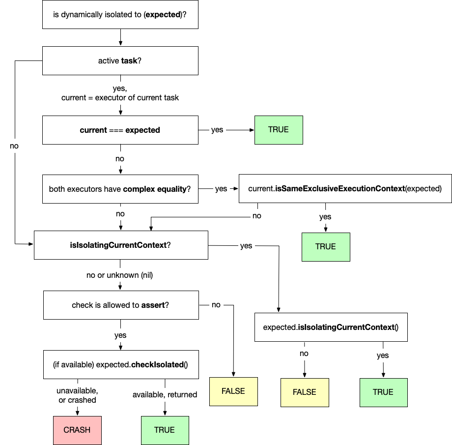

# Improved Custom SerialExecutor isolation checking for Concurrency Runtime 

* Proposal: [SE-0471](0471-SerialExecutor-isIsolated.md)
* Author: [Konrad 'ktoso' Malawski](https://github.com/ktoso)
* Review Manager: [Doug Gregor](https://github.com/DougGregor)
* Status: **Implemented (Swift 6.2)**
* Implementation: https://github.com/swiftlang/swift/pull/79788 & https://github.com/swiftlang/swift/pull/79946
* Review: [Pitch](https://forums.swift.org/t/pitch-serialexecutor-improved-custom-serialexecutor-isolation-checking/78237/), [Review](https://forums.swift.org/t/se-0471-improved-custom-serialexecutor-isolation-checking-for-concurrency-runtime/78834), [Acceptance](https://forums.swift.org/t/accepted-se-0471-improved-custom-serialexecutor-isolation-checking-for-concurrency-runtime/79894)

## Introduction

In [SE-0424: Custom isolation checking for SerialExecutor](https://github.com/swiftlang/swift-evolution/blob/main/proposals/0424-custom-isolation-checking-for-serialexecutor.md) we introduced a way for custom executors implementing the `SerialExecutor` protocol to assert and assume the static isolation if the dynamic check succeeded. This proposal extends these capabilities, allowing custom executors to not only "check and crash if assumption was wrong", but also check and act on the result of the check.

## Motivation

The previously ([SE-0424](https://github.com/swiftlang/swift-evolution/blob/main/proposals/0424-custom-isolation-checking-for-serialexecutor.md)) introduced family of `Actor/assertIsolated()`, `Actor/preconditionIsolated()` and `Actor/assumeIsolated(operation:)` all rely on the `SerialExecutor/checkIsolated()` API which was introduced in the same proposal.

These APIs all follow the "*pass or crash*" pattern. Where the crash is caused in order to prevent an incorrect assumption about isolation resulting in unsafe concurrent access to some isolated state. This is frequently used by methods which are "known to be called" on some specific actor to recover the dynamic (known at runtime) isolation information, into its static equivalent and therefore safely access some isolated state, like in this example:

```swift
@MainActor 
var counter: Int = num

protocol P {
  // Always called by the main actor, 
  // yet protocol author forgot to annotate the method or protocol using @MainActor
  func actuallyWeKnowForSureThisIsCalledFromTheMainActor()
}

struct Impl: P {
  func actuallyWeKnowForSureThisIsCalledFromTheMainActor() {
    MainActor.assumeIsolated { // we know this is safe here
      counter += 1
    }
  }
}

@MainActor
func call(p: some P) {
  p.actuallyWeKnowForSureThisIsCalledFromTheMainActor()
}
```

This works fine for many situations, however some libraries may need to be more careful when rolling out strict concurrency checks like these, and instead of crashing may want to choose to issue warnings before they adopt a mode that enforces correct use.

Currently all APIs available are using the `checkIsolated()` API which must crash if called from a context not managed by the serial executor it is invoked on. This method is often implemented using `dispatchPrecondition()` when the serial executor is backed using `Dispatch` or custom `fatalError()` messages otherwise:

```swift
final class ExampleExecutor: SerialExecutor {
  func checkIsolated() {
    dispatchPrecondition(condition: .onQueue(self.queue))
  }
}
```

This approach is better than not being able to participate in the checks at all (i.e. this API allows for advanced thread/queue sharing between actor and non-actor code), but it has two severe limitations:

- the crash **messages** offered by these `checkIsolated()`  crashes **are often sub-optimal** and confusing
  - messages often don't include crucial information about which actor/executor the calling context was _actually_ executing on. Offering only "expected [...]" messages, leading to hard to debug crashes.
- it is **impossible** for the Swift runtime to offer **isolation violation warnings**
  - because the Swift runtime _must_ call into a custom executor to verify its isolation, the "pass or crash" method will crash, rather than inform the runtime that a violation occurred and we should warn about it.

Today, it is not possible for the Swift runtime to issue _warnings_ if something is detected to be on not the expected executor, but somehow we'd still like to continue without crashing the application. 

And for existing situations when `assumeIsolated()` is called and _should_ crash, by using this new API the Swift runtime will be able to provide _more informative_ messages, including all available context about the execution environment.

## Proposed solution

We propose to introduce a new `isIsolatingCurrentContext` protocol requirement to the `SerialExecutor` protocol:

```swift
protocol SerialExecutor {

  /// May be called by the Swift runtime before `checkIsolated()`
  /// in order to check for isolation violations at runtime, 
  /// and potentially issue isolation warnings.
  ///
  /// [...]
  func isIsolatingCurrentContext() -> Bool

  // existing API, since SE-0424
  @available(SwiftStdlib 6.0, *)
  func checkIsolated() // must crash if run on a context not managed by this serial executor
  
  // ... 
}

extension SerialExecutor { 
  /// Default implementation for backwards compatibility.
  func isIsolatingCurrentContext() -> Bool? { nil }
}
```

The Swift runtime is free to call the `isIsolated` function whenever it wants to verify if the current context is appropriately isolated by some serial executor. 

In most cases implementing this new API is preferable to implementing `checkIsolated()`, as the Swift runtime is able to offer more detailed error messages when an isolation failure detected by a call to `isIsolatingCurrentContext()` is detected.

## Detailed design

The newly proposed `isIsolatingCurrentContext()` function participates in the previously established runtime isolation checking flow, and happens _before_ any calls to `checkIsolated()` are attempted. The following diagram explains the order of calls issued by the runtime to dynamically verify an isolation when e.g. `assumeIsolated()` is called:



There are a lot of conditions here and availability of certain features also impacts this decision flow, so it is best to refer to the diagram for detailed analysis of every situation. However the most typical situation involves executing on a task, which has a potentially different executor than the `expected` one. In such situation the runtime will:

- check for the existence of a "current" task,
- (fast path) if a task is present: 
  - compare the current task's serial executor it is isolated to (if any) with the expected serial executor,

- :new: if **`isIsolatingCurrentContext`** **is available** on the `expected`  executor:
  - invoke `isIsolatingCurrentContext` 
  - ✅ if it returned true: pass the check.
  - :x: if it returned false: fail the check.
  - The runtime will **not** proceed to call `checkIsolated` after `isIsolated` is invoked!

- if **`isIsolatingCurrentContext`** is **not available** on the expected executor, but **`checkIsolated`** **is available**:
  - invoke `expected.checkIsolated` which will crash :x: or pass :white_check_mark: depending on its internal checking.
- if neither `checkIsolated` or `isIsolatingCurrentContext` are available, 
  - :x: crash with a best effort message.


This proposal specifically adds the "if `isIsolatingCurrentContext` is available" branch into the existing logic for confirming the isolation expectation.

If `isIsolatingCurrentContext` is available, effectively it replaces `checkIsolated` because it does offer a sub-par error message experience and is not able to offer a warning if Swift would be asked to check the isolation but not crash upon discovering a violation.

### The `isIsolatingCurrentContext` checking mode

The `isIsolatingCurrentContext` method effectively replaces the `checkIsolated` method, because it can answer the same question if it is implemented.

Some runtimes may not be able to implement a the returning `isIsolatingCurrentContext`, and they are not required to implement the new protocol requirement.

The default implementation returns `nil` which is to be interpreted by the runtime as "unknown" or "unable to confirm the isolation", and the runtime may proceeed to call futher isolation checking APIs when this function returned `nil`.

The general guidance about which method to implement is to implement `isIsolatingCurrentContext` whenever possible. This method can be used by the Swift runtime in "warning mode". When running a check in this mode, the `checkIsolated` method cannot and will not be used because it would cause an unexpected crash. An executor may still want to implement the `checkIsolated` function if it truly is unable to return a true/false response to the isolation question, but can only assert on an illegal state. The `checkIsolated` function will not be used when the runtime cannot tollerate the potential of crashing while performing an isolation check (e.g. isolated conformance checks, or when issuing warnings).

The runtime will always invoke the `isIsolatingCurrentContext` before making attempts to call `checkIsolated`, and if the prior returns either `true` or `false`, the latter (`checkIsolated`) will not be invoked at all.

### Checking if currently isolated to some `Actor`

We also introduce a way to obtain `SerialExecutor` from an `Actor`, which was previously not possible.

This API needs to be scoped because the lifetime of the serial executor must be tied to the Actor's lifetime:

```swift
extension Actor { 
  /// Perform an operation with the actor's ``SerialExecutor``.
  ///
  /// This converts the actor's ``Actor/unownedExecutor`` to a ``SerialExecutor`` while
  /// retaining the actor for the duration of the operation. This is to ensure the lifetime
  /// of the executor while performing the operation.
  @_alwaysEmitIntoClient
  @available(SwiftStdlib 5.1, *)
  public nonisolated func withSerialExecutor<T, E: Error>(_ operation: (any SerialExecutor) throws(E) -> T) throws(E) -> T

  /// Perform an operation with the actor's ``SerialExecutor``.
  ///
  /// This converts the actor's ``Actor/unownedExecutor`` to a ``SerialExecutor`` while
  /// retaining the actor for the duration of the operation. This is to ensure the lifetime
  /// of the executor while performing the operation.
  @_alwaysEmitIntoClient
  @available(SwiftStdlib 5.1, *)
  public nonisolated func withSerialExecutor<T, E: Error>(_ operation: (any SerialExecutor) async throws(E) -> T) async throws(E) -> T
  
}
```

This allows developers to write "warn if wrong isolation" code, before moving on to enable preconditions in a future release of a library. This gives library developers, and their adopters, time to adjust their code usage before enabling more strict validation mode in the future, for example like this:

```swift
func something(operation: @escaping @isolated(any) () -> ()) {
  operation.isolation.withSerialExecutor { se in 
    if !se.isIsolatingCurrentContext() { 
      warn("'something' must be called from the same isolation as the operation closure is isolated to!" + 
           "This will become a runtime crash in future releases of this library.")
    }
  }
}
```


This API will be backdeployed and will be available independently of runtime version of the concurrency runtime.

### Compatibility strategy for custom SerialExecutor authors

New executor implementations should prioritize implementing `isIsolatingCurrentContext` when available, using an appropriate `#if swift(>=...)` check to ensure compatibility. Otherwise, they should fall back to implementing the crashing version of this API: `checkIsolated()`.

For authors of custom serial executors, adopting this feature is an incremental process and they can adopt it at their own pace, properly guarding the new feature with necessary availability guards. This feature requires a new version of the Swift concurrency runtime which is aware of this new mode and therefore able to call into the new checking function, therefore libraries should implement and adopt it, however it will only manifest itself when the code is used with a new enough concurrency runtime

As a result, this change should cause little to no disruption to Swift concurrency users, while providing an improved error reporting experience if using executors which adopt this feature.

## Source Compatibility

This proposal is source compatible, a default implementation of the new protocol requirement is introduced along with it, allowing existing `SerialExecutors` to compile without changes.

## Binary Compatibility

This proposal is ABI additive, and does not cause any binary incompatibility risks.

## Future directions

### Expose `isIsolated` on (Distributed)Actor and MainActor?

We are _not_ including new public API on Actor types because of concerns of this function being abused.

If we determine that there are significant good use-cases for this method to be exposed, we might reconsider this position.

## Alternatives considered

### Somehow change `checkIsolated` to return a bool value

This would be ideal, however also problematic since changing a protocol requirements signature would be ABI breaking.

### Deprecate `checkIsolated`?

In order to make adoption of this new mode less painful and not cause deprecation warnings to libraries which intend to support multiple versions of Swift, the `SerialExcecutor/checkIsolated` protocol requirement remains _not_ deprecated. It may eventually become deprecated in the future, but right now we have no plans of doing so.

### Model the SerialExecutor lifetime dependency on Actor using `~Escapable`

It is currently not possible to express this lifetime dependency using `~Escapable` types, because combining `any SerialExecutor` which is an `AnyObject` constrained type, cannot be combined with `~Escapable`. Perhaps in a future revision it would be possible to offer a non-escapable serial executor in order to model this using non-escapable types, rather than a `with`-style API.

## Changelog

- added way to obtain `SerialExecutor` from `Actor` in a safe, scoped, way. This enables using the `isIsolatingCurrentContext()` API when we have an `any Actor`, e.g. from an `@isolated(any)` closure.
- changed return value of `isIsolatingCurrentContext` from `Bool` to `Bool?`, where the `nil` is to be interpreted as "unknown", and the default implementation of `isIsolatingCurrentContext` now returns `nil`.
- removed the manual need to signal to the runtime that the specific executor supports the new checking mode. It is now detected by the compiler and runtime, checking for the presence of a non-default implementation of the protocol requirement.
