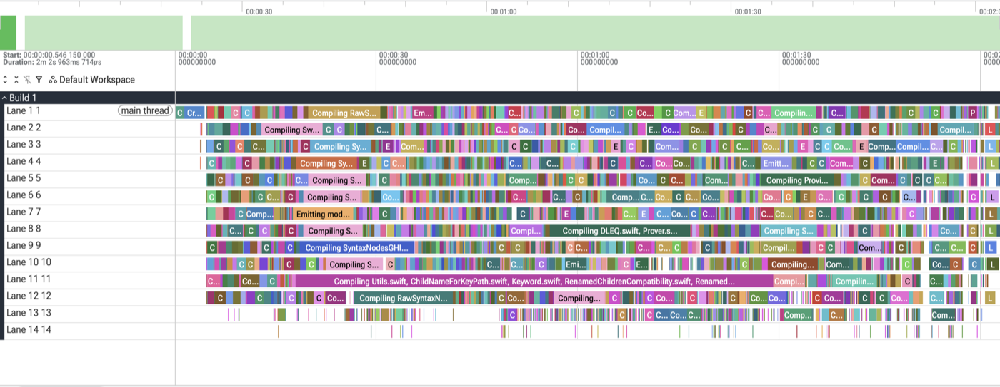

# SwiftPM Build Performance Debugging Options

* Proposal: [SE-NNNN](NNNN-build-debugging-options.md)
* Authors: [Owen Voorhees](https://github.com/owenv)
* Implementation: Nightly snapshot toolchains via experimental flags `--experimental-trace-events-file` and `--experimental-task-backtraces`
* Review: ([pitch](https://forums.swift.org/t/pitch-swiftpm-build-performance-debugging-options/87369))

## Introduction

This proposal introduces two new SwiftPM CLI options, `--trace-events-file` and `--enable-task-backtraces`, which can be used to analyze the performance of clean and incremental builds and identify common issues.

## Motivation

Build performance is an important component of developer productivity. Clean build performance is largely determined by how much work is required to build a package and how effectively that work can be parallelized, while incremental build performance also depends on how much of a build is invalidated by a particular incremental change. When analyzing build performance of a package, it's sometimes difficult to determine how build tools and package configuration influence these factors and where there are opportunities to make improvements. This proposal introduces new command line options which give users greater insight into build performance so that they can make more informed decisions when optimizing build times or debugging build performance issues.

## Proposed solution

This proposal introduces two new flags which may be passed to any SwiftPM subcommand which runs a build:
* `--trace-events-file`: When passed with a path argument, will cause a JSON file to be emitted using the [Trace Event Format](https://docs.google.com/document/d/1CvAClvFfyA5R-PhYUmn5OOQtYMH4h6I0nSsKchNAySU/preview) which describes the timing of tasks run as part of the current build. This file can be viewed using a performance analysis tool like [Perfetto](https://perfetto.dev), [speedscope](https://www.speedscope.app), or `about://tracing` in Chrome.
* `--enable-task-backtraces`: When passed, will cause the build log to include a 'task backtrace' for each task which describes the sequence of events which caused it to run as part of the current build.

## Detailed design

### `--trace-events-file`

`--trace-events-file <trace-path>` may be passed to any SwiftPM subcommand which runs a build, including `swift build`, `swift test`, and `swift-run`. When passed, SwiftPM will emit a file at `<trace-path>` using the Trace Event Format which includes command line, timing, and (optionally) backtrace information for each task run during the build. If an existing file exists at `<trace-path>`, it will be overwritten when the build starts.

The [Trace Event Format](https://docs.google.com/document/d/1CvAClvFfyA5R-PhYUmn5OOQtYMH4h6I0nSsKchNAySU/preview) is a JSON-based format for compiling performance data. It's supported by a variety of producers ([clang](https://clang.llvm.org/docs/analyzer/developer-docs/PerformanceInvestigation.html), [Bazel](https://bazel.build/advanced/performance/json-trace-profile)) and consumers ([Perfetto](https://perfetto.dev), [speedscope](https://www.speedscope.app), Chrome `about://tracing`), making it a good candidate for adoption by SwiftPM.

Here's an example of a trace emitted when building SwiftPM itself, visualized using Perfetto:



This type of visualization can be very helpful when optimizing a clean build to improve parallelism, identifying expensive work on the critical path, or identifying the full set of tasks running in an incremental build after making a particular change.

### `--enable-task-backtraces`

Visualizing the trace of a build can be used to identify which tasks ran in an incremental build, but it's not always easy to identify why those tasks needed to run. Task backtraces help answer this question by enumerating the sequence of steps which led a task to be invalidated and re-run.

Task backtraces are enabled by passing `--enable-task-backtraces` to any SwiftPM subcommand which runs a build. This flag must be paired with either `--trace-events-file` to include the backtrace information in the build trace, `--verbose`/`--very-verbose` to include it in the build output, or both. Task backtraces are provided as an opt-in feature intended to be used primarily when debugging incremental builds, as they have a small but measurable impact on overall build performance.

Here's an example of a backtrace from an incremental build of SwiftPM itself, describing why the `swift-build` executable was re-linked in an incremental build after making a change to `URL.swift` in the `Basics` module of the package:

```
#0: an input of 'Link swift-build (arm64)' changed
#1: the task producing file '.../swiftpm/.build/out/Products/Debug/Basics.o' ran
#2: an input of 'Link Basics.o (arm64)' changed
#3: the task producing file '.../swiftpm/.build/out/Intermediates.noindex/SwiftPM.build/Debug/Basics-t.build/Objects-normal/arm64/URL.o' ran
#4: an input of 'Compile Basics (arm64)' changed
#5: file '.../swiftpm/Sources/Basics/URL.swift' changed
```

The first line of the backtrace describes the most immediate reason the link task needed to run: one of its inputs had changed. From there, the backtrace can be read top to bottom to understand the full chain of events which connect this change to the original change, the user-initated modification to `URL.swift`. In this case, the change to `URL.swift` meant it needed to be recompiled, which in turn invalidated the corresponding object file, which in turn invalidated the link of the `Basics` target, which in turn invalidated the link of the final executable.

In addition to diagnosing changes in input files, task backtraces could also indicate a task needed to run in an incremental build because:
* Its arguments, working directory, or environment changed
* One of its outputs was deleted or otherwise modified outside the build
* The previous build failed or was cancelled before the task ran

The specific formatting of task backtraces is implementation defined to allow flexibility for future improvements which provide more specific information.

## Security

This change has no meaningful security impact. It emits additional information during builds which is either not sensitive (timing information) or already present in verbose logging (builder file paths in backtraces).

## Impact on existing packages

There is no impact on the build of existing packages, the new logging is opt in and does not change the behavior of the build itself.

## Alternatives considered

### Design a new build trace format

Instead of adopting the existing Trace Event Format, one could argue we should consider designing a new format from scratch for SwiftPM build traces. This might make it easier to represent SwiftPM/Swift-specific concepts more accurately. However, in practice, the existing format does a good job of representing build task timing information, and its freeform arguments fields allow it to support features like task backtrace information in a natural way. Furthermore, adopting a well-established format has a number of interoperability advantages. Users have a number of choices for visualizing traces, and it enables interesting future directions like merging Clang `-ftime-trace` output with a SwiftPM trace to get a combined trace of high-level build and granular compile performance.