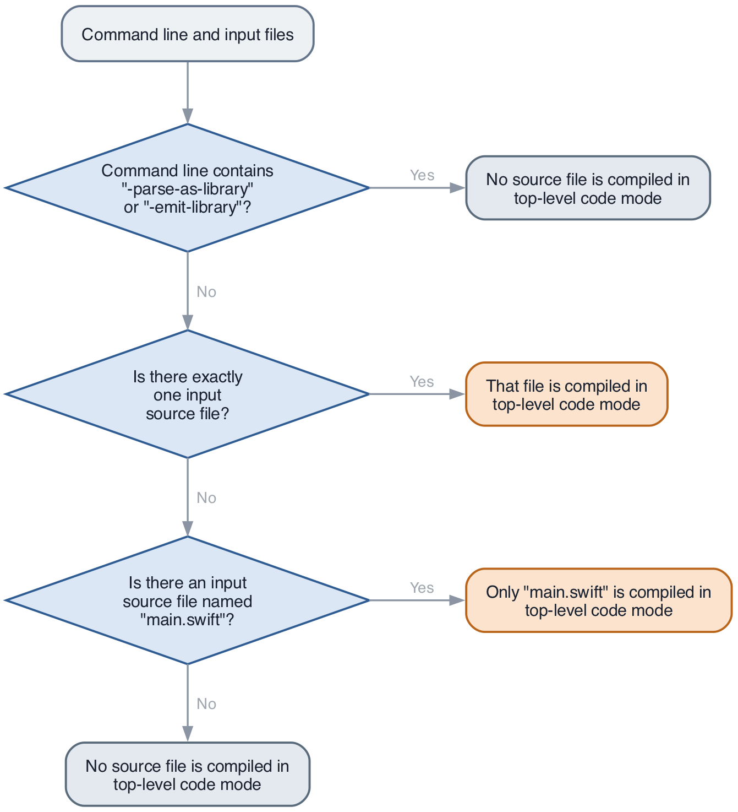
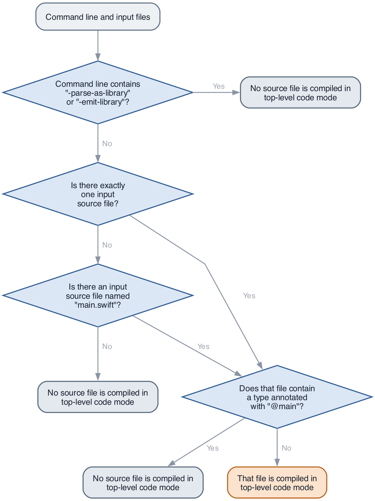

# Improve Interaction Between `@main` and Top-Level Code

* Proposal: [SE-NNNN](NNNN-improve-top-level-code-inference.md)
* Authors: [Owen Voorhees](https://github.com/owenv)
* Implementation: [PR-91761](https://github.com/swiftlang/swift/pull/91761)
* Review: ([pitch](https://forums.swift.org/t/pitch-improve-interaction-between-main-and-top-level-code/89259))

## Introduction

The current rules which determine if a source file is parsed as top-level code are hard to understand and often cause confusing errors to be reported when adopting `@main`. This proposal describes a source compatible change which disables top-level code parsing in sources where it's very likely the user did not intend to use this mode.

## Motivation

Top-level code refers to statements which appear at the top level of a source file, outside of any declaration. It's most often used in scripts and demo code. For example, it's what makes the following a valid Swift program:

```swift
// foo.swift
// ---------
func computeNum() -> Int {
    42
}

// Below is top-level code
let num = computeNum()
print(num)
```

There are a number of differences in how top-level code is parsed compared to the parsing of "normal" Swift code, including:
- Statements and expressions may appear at the top level and are used to synthesize a program entrypoint
- Top-level variable declarations are treated as local variables, except for those with certain attributes like `@section`
- A top-level reference to a macro is treated as an expression macro expansion rather than a freestanding declaration macro expansion

The conditions which cause a file to be parsed in top-level code mode are complex:
- If the module is compiled with `-parse-as-library` or `-emit-library`, none of its sources are compiled in top-level code mode
- Otherwise, if the module contains only one source file, it is compiled in top-level code mode
- Otherwise, if the module contains a file named "main.swift", that file is compiled in top-level code mode
- Otherwise, none of the module's sources are compiled in top-level code mode



Notably, when a module contains a file which is parsed in top-level code mode, the top-level code in that file is used to synthesize a program entrypoint. Therefore, that module can't also use `@main` to declare an entrypoint, even if the module doesn't actually contain a top-level statement or expression. The resulting behavior can be very unintuitive. Consider the following single file program:

```swift
// foo.swift
// ---------
@main
struct EntryPoint {
    static func main() {
        print("hello, world!")
    }
}
```

If compiled with `swiftc foo.swift -o foo`, the following error is reported:

```
foo.swift:1:1: error: 'main' attribute cannot be used in a module that contains top-level code
1 | @main
  | |- error: 'main' attribute cannot be used in a module that contains top-level code
  | |- note: top-level code defined in this source file
  | `- note: pass '-parse-as-library' to compiler invocation if this is intentional
2 | struct EntryPoint {
3 |     static func main() {
```

While `swiftc foo.swift -o foo -parse-as-library` allows this example to compile as expected, the error is very hard to understand because the source file doesn't appear to actually contain any top-level code. The inference was solely based on the fact that the module contains a single source file.

The following program demonstrates a similar issue:

```swift
// main.swift
// ----------
@main
struct EntryPoint {
    static func main() {
        myHelper()
    }
}
// bar.swift
// ---------
func myHelper() {
    // ...
}
```

Again, `swiftc main.swift bar.swift -o foo` reports an error and necessitates passing the poorly-named `-parse-as-library`:

```
main.swift:1:1: error: 'main' attribute cannot be used in a module that contains top-level code
1 | @main
  | |- error: 'main' attribute cannot be used in a module that contains top-level code
  | |- note: top-level code defined in this source file
  | `- note: pass '-parse-as-library' to compiler invocation if this is intentional
2 | struct EntryPoint {
3 |     static func main() {
```

This type of failure tends to impact beginners the most, as they often name a source file `main.swift` based on experience using other languages, only to run into this sharp edge when trying to use a library like `ArgumentParser` which relies on an `@main`-style entrypoint.

Higher-level build tools like SwiftPM and xcodebuild have added their own heuristics to sometimes pass `-parse-as-library` on the user's behalf in order to paper over these issues. In practice, this has led to even more inconsistent and confusing behavior across the ecosystem. Ideally, the compiler should always infer what the user most likely intended, and build systems shouldn't need to know anything about how top-level code works.

## Proposed solution

Source files which contain an `@main`-annotated type but which currently meet the criteria to be parsed in top-level code mode should instead be parsed normally.

## Detailed design

### `@main` Suppresses Parsing of Top Level Code

The conditions which determine how a file is parsed remain the same, except for the cases where a file is currently parsed in top-level code mode. In these cases:
- If the source file contains a type annotated with `@main`, it will be parsed normally. Types in inactive conditional compilation branches don't satisfy the condition.
- Otherwise, it will be parsed in top-level code mode.

The new decision tree looks like this:



While the new rules add another condition, it only applies in cases which fail to compile today. The goal is to more accurately match users' intuition without changing the meaning of existing code. With these revised rules, both examples from the 'Motivation' section successfully compile.

### Deprecated Entrypoint Attributes

Although deprecated and diagnosed as an error in the Swift 6 language mode, this proposal treats the `@NSApplicationMain` and `@UIApplicationMain` attributes as equivalent to `@main` in earlier language modes which still allow their use. Both attributes will also disable top level code parsing in a file that would otherwise allow it. Use of these attributes remains discouraged, but treating them the same as `@main` when determining parsing behavior results in less surprising behavior. Instead of a confusing error about top level code, users will only see a deprecation warning encouraging them to adopt `@main`.

### SwiftPM Updates

SwiftPM currently applies a flawed heuristic to pass `-parse-as-library` to the compile of executable target sources which contain the literal text "@main". In the upcoming tools version, this heuristic will be removed and executable targets will never be built with `-parse-as-library`.

## Source compatibility

The proposed change is source compatible because it only impacts parsing of sources which currently fail to compile because they both contain an `@main` type and are parsed in top-level code mode. SwiftPM behavioral changes are restricted to new tools versions.

## ABI compatibility

The proposed change does not change the ABI of declarations in any existing programs.

## Alternatives considered

### Infer parsing mode based on the presence or absence of top-level statements or expressions

Instead of choosing to parse a file normally when it contains an `@main` type, we could instead parse it normally if it does not contain any top-level statements or expressions. Conceptually, this is a simpler rule, but in practice it has the potential to change the meaning of existing code due to changes in how top-level variable declarations are handled in the two modes. Consider the following program:

```swift
// main.swift
// ----------
struct MyApp {
    init() async {
        // Start some kind of run loop
    }
}

let app = await MyApp()
```

This code compiles today because `let app = await MyApp()` is compiled as top-level code and treated as a local variable declaration. However, the file doesn't contain a top-level statement or expression. If we used this as a signal to parse the file normally instead, compilation would fail:

```
main.swift:7:17: error: 'async' call cannot occur in a global variable initializer
5 | }
6 | 
7 | let app = await MyApp()
  |                 `- error: 'async' call cannot occur in a global variable initializer
8 |
```

The proposed rule was picked over this one primarily because it doesn't change the meaning of code which currently compiles successfully.

### Consider `@main` types in other source files when inferring parsing mode

In the proposed design, the following program would remain invalid because the `@main` type is not in the file inferred to be top-level code:

```swift
// main.swift
// ----------
func foo() {}

// bar.swift
// ---------
@main struct Foo {
  static func main() {}
}
```
```
bar.swift:1:1: error: 'main' attribute cannot be used in a module that contains top-level code
1 | @main struct Foo {
  | `- error: 'main' attribute cannot be used in a module that contains top-level code
2 |   static func main() {}
3 | }

main.swift:1:1: note: top-level code defined in this source file
1 | func foo() {}
  | |- note: top-level code defined in this source file
2 | 
```

Ideally, this program would 'just work' and use the `@main` type as the entry point. However, supporting this would mean parsing the main file in a module would depend on the result of parsing the rest of that module's sources, which is undesirable from a tooling perspective.

### Ban top-level code entirely except in script mode

With the exception of immediate-mode scripts run using `swift`, most new Swift programs use an `@main`-based entry point rather than one generated from top-level code. We could choose to ban top-level code entirely from modules compiled using `swiftc`. This would vastly simplify the process of determining when top-level code is allowed, but it's a large enough breaking change that it would be too disruptive outside of a new language mode.

### Deprecate or remove the `-parse-as-library` flag

Ideally `-parse-as-library` could be removed entirely. However, even with the changes in this proposal it remains useful for ensuring the compilation of a single file library does not synthesize a program entrypoint. With the changes in this proposal, the flag's name should more accurately reflect how it's used in the cases where it's still needed.

