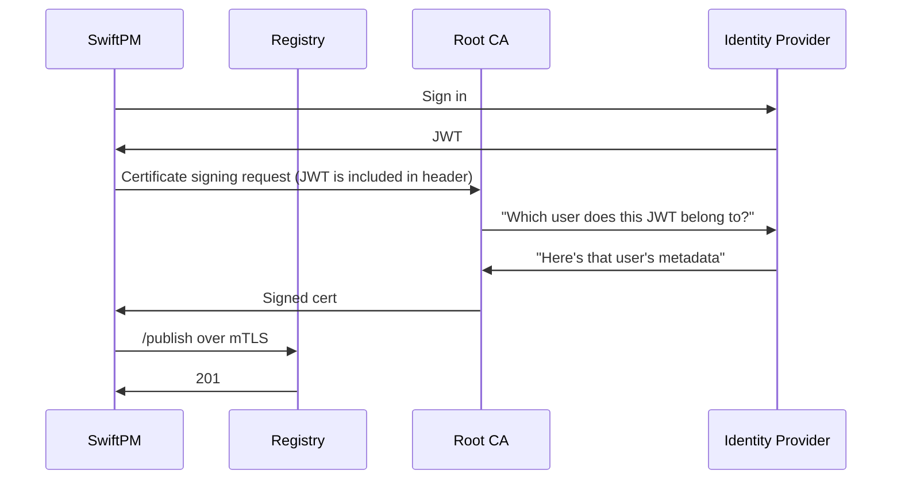

# Package Registry Mutual TLS Authentication

* Proposal: [SE-NNNN](NNNN-filename.md)
* Author: [Gabe Braden](https://github.com/thePianoKid)
* Review Manager: TBD
* Status: Awaiting implementation
* Implementation: https://github.com/swiftlang/swift-package-manager/pull/10578

## Introduction

[SE-0292](https://github.com/swiftlang/swift-evolution/blob/main/proposals/0292-package-registry-service.md#specifying-credentials-for-a-custom-registry) and [SE-0378](https://github.com/swiftlang/swift-evolution/blob/main/proposals/0378-package-registry-auth.md) added basic and bearer authentication to the registry spec. This proposal adds a third authentication method: mutual TLS (specifically TLS 1.3: [RFC 9846](https://www.rfc-editor.org/info/rfc9846/)). The client authenticates by presenting an X.509 certificate during the TLS handshake.

---

## Motivation

Basic and bearer credentials don't require proof of possession. If an attacker intercepts one, it can be used for the lifetime of the credential.

To authenticate via mutual TLS, the client must prove they have the correct private key. If an attacker wants to impersonate a user, they must gain access to their machine and steal the private key.

---

## Proposed Solution

* Add mutual TLS (`mTLS`) as a registry authentication type.
* `swift package-registry login <url> --cert <path to cert> --key <path to key>`
  * Tests whether the registry accepts the given identity. Updates the registry configuration if the identity is valid.
* Keychain support on macOS: `swift package-registry login <url> --identity-common-name <name>`

mTLS is an optional authentication method. Each registry implementation controls whether it inspects provided client certificates, and how it performs authorization.

---

## Detailed Design

### Registry Service

#### mTLS authentication

[RFC 9846](https://www.rfc-editor.org/info/rfc9846/) defines how to verify an actor's identity on the network layer. Mutual TLS (mTLS) authentication extends this RFC: the client and server check each other's certificates. If this check is successful, authentication is complete: the registry can now extract an identity from the presented certificate to ensure the client is authorized to make the request.

This specification does not define how to create a valid certificate, or how the registry performs mTLS authentication. That is registry-specific.

#### Login

The existing `/login` endpoint from [SE-0378](https://github.com/swiftlang/swift-evolution/blob/main/proposals/0378-package-registry-auth.md#new-package-registry-service-api) can now receive a client certificate.

```swift
GET /login HTTP/1.1
Host: packages.example.com

```

The endpoint still returns a `200` status code. The network layer checks the presented certificate and ensures the client has the private key. The application layer simply returns a `200`.

`/login` is the default location, but [it can be overridden](https://github.com/swiftlang/swift-evolution/blob/main/proposals/0378-package-registry-auth.md#override-login-url).

#### Other requests

Other requests to the registry stay the same. For example, publishing is the same request from [SE-0321](https://github.com/swiftlang/swift-evolution/blob/main/proposals/0321-package-registry-publish.md), now to a new host:

```swift
PUT /{scope}/{name}/{version} HTTP/1.1
Host: packages.example.com

```

If the connection is successful, the client is authenticated. The application layer of the registry can now get the user's identity from the presented certificate, then check if the user is authorized to make the request.

### Swift Package Manager

#### `swift package-registry login`

**SYNOPSIS**

```swift
swift package-registry login [<url>] 
--cert <path> --key <path>
--identity-common-name <Common Name of an identity stored in the keychain>
--identity-hash <Hash of an identity stored in the keychain>

```

**OPTIONS**

* `--cert <path>` Path to a client certificate (PEM).
* `--key <path>` Path to its private key (PEM). Required with `--cert`.
* `--identity-common-name <certificate's CN>` An identity (a key + certificate pair) can be stored in a macOS user's keychain. The certificate's Common Name (CN) field is a human-readable string that may uniquely identify an identity. If two identities have the same CN, the user is prompted to use `--identity-hash`
* `--identity-hash <hash>` The SHA-1 hash of an identity uniquely identifies it. SwiftPM looks for an identity in a macOS user's keychain with the given hash.

**EXAMPLE**

```swift
$ swift package-registry login https://packages.example.com --cert <path> --key <path>
Login successful.
Registry configuration updated.

```

```swift
$ swift package-registry login https://nomtls.example.com --cert <path> --key <path>
error: Registry https://packages.example.com rejected the provided client certificate

```

```swift
$ swift package-registry login https://packages.example.com --cert <path> --key <path>
error: The registry rejected the certificate presented over mTLS.

```

```swift
$ swift package-registry login https://packages.example.com --identity-common-name "Duplicated Name"
error: Multiple identities have the same common name "Duplicated Name":
1) A9D8E7C6B5A49382710FABCD1234EF567890ABCD "Duplicated Name" 
2) F1E2D3C4B5A6978876543210FEDCBA9876543210 "Duplicated Name"
Use --identity-hash instead.

```

SwiftPM MUST support combining basic/bearer authentication with mTLS:

```swift
$ swift package-registry login https://packages.example.com --token <token> --cert <path> --key <path>

```

#### Configuration

`login` records the identity in the user-level `registries.json`:

```json
{
  "authentication": {
    "packages.example.com": {
      "type": "mtls",
      "identity": {
        "files": {
          "certificatePath": "/Users/mona/.swiftpm/security/registry-identities/packages.example.com.cer",
          "privateKeyPath": "/Users/mona/.swiftpm/security/registry-identities/packages.example.com.key"
        }
      },
    }
  },
  "version": 1
}

```

* `type` gains a third value, `mtls`, alongside `basic` and `token`.
* `identity` names the identity. This could be a path, a Common Name or a hash.

There are different permutations of `identity`:

```swift
// Identity stored in the keychain:
"identity": {
    "keychain": {
        // The CN and the hash are both stored
        // regardless of whether the hash or CN was passed in to SwiftPM
        "commonName": "Some Name"
        "hash": "A9D8E7C6B..."
    }
}

```

The configuration should support Basic/Bearer auth over mTLS:

```swift
"packages.example.com" : {
    "type" : "token",
    "identity": {
        "files": {
          "certificatePath": "<path>",
          "privateKeyPath": "<path>"
        }
    }
}

```

---

## Security

### HTTPS

Registries that support mTLS MUST use `https`. SwiftPM rejects a non-`https` `mutualTLSURL`, and `--allow-insecure-http` has no effect on a registry with authentication configured.

### Certificate rotation

Here are two recommendations for registry implementors that want to support certificate rotation:

* The registry's root CA mints short-lived certs (\~15 minute TTL).
* The registry checks the root CA's CRL and/or OCSP responder to see whether the certificate has been revoked.

---

## Impact on Existing Packages

mTLS auth is "opt-in". Registries that do not implement mTLS are unaffected, packages are unaffected, and basic and token authentication behave exactly as before. Existing `registries.json` files decode unchanged.

There is an issue with backwards compatibility: a `registries.json` containing `"type": "mtls"` cannot be read by toolchains released before this change. Any command that needs a package resolve will fail if it doesn't recognize `"type": "mtls"`. The only fix is to update SwiftPM or remove the offending entry from `registries.json`.

---

## Alternatives Considered

#### SwiftPM generates certificates

Instead of SwiftPM users generating the cert and key out-of-band, the initial proposal had SwiftPM generating a self-signed cert that would be registered with the catalog. This was rejected because it weakens the security of mTLS authentication: the self-signed certs are registered by providing basic/bearer tokens. If an attacker steals the user's long-lived credentials, mTLS auth is vulnerable.

---

## Future Directions

### User identity

If Swift registries support identity providers, mTLS auth could bind the user's identity so the cert like so:



### Certificate-bound tokens

Once SwiftPM supports mTLS, a registry could add certificate bound access tokens ([RFC 8705, section 3](https://www.rfc-editor.org/info/rfc8705/#section-3)). That way, tokens can't be replayed because the registry requires possession of the private key.

### Externally provisioned identities

In this proposal, the private key lives on the file system, or in the keychain. Support for PKCS#11 means the private key can be securely stored on Linux and Windows.

