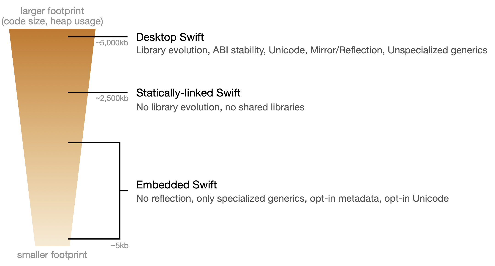

# A Vision for Embedded Swift

## Introduction

Swift is a general purpose programming language suitable for both high-level application software and for low-level systems software. The existing major supported deployments of Swift are primarily targeting “large” operating systems (Linux, Windows, macOS, iOS), where storage and memory are relatively plentiful, multiple applications share code via dynamic linking, and the system can be expected to provide a number of common libraries (such as the C and C++ standard libraries). The typical size of the Swift runtime and standard library in these environments is around 5MB of binary size.

However, lots of embedded platforms and low-level environments have constraints that make the standard Swift distribution impractical. These constraints have been described and discussed in existing prior work in this area, and there have been great past discussions in the Swift forums ([link](https://forums.swift.org/t/introduce-embedded-development-using-swift/56573)) and in last year’s video call ([link](https://forums.swift.org/t/call-for-interest-video-call-kickoff-using-swift-for-embedded-bare-metal-low-resources-programming/56911)), which shows there is a lot of interest and potential for Swift in this space. The motivation of “Embedded Swift” is to achieve a first class support for embedded platforms and unblock porting and using Swift in small environments. In particular the targets are:

* (1) Platforms that have very limited memory
    * Microcontrollers and embedded systems with limited memory
        * Popular MCU board families and manufacturers (Arduino, STM32, ESP32, NXP, etc.) commonly offer boards that only have an order of 10’s or 100’s of kB of memory available.
    * Firmware, and especially firmware projects that are run from SRAM, or ROM
* (2) Environments where runtime dependencies, implicit runtime calls, and heap allocations are restricted
    * Low-level environments without an underlying operating system, such as bootloaders, hypervisors, firmware
    * Operating system kernels, kernel extensions, and other non-userspace software components
    * Userspace components that are too low-level in terms of dependencies, namely anything that the Swift runtime depends on.
        * A special case here is the Swift runtime itself, which is today written in C++. The concepts described further in this document allow Swift to become the implementation language instead.

A significant portion of the current Swift runtime and standard library supports Swift’s more dynamic features, particularly those that involve metadata. These features include:

* Dynamic reflection facilities (such as mirrors, `as?` downcasts, and printing arbitrary values)
* Existentials
* ABI stability with support for library evolution
* Separately-compiled generics
* Dynamic code loading (plug-ins)

On “smaller” operating systems, and in restricted environments with limited binary and memory size, the size of a full Swift standard library (with all public types and APIs present) and a Swift runtime, as well as the metadata required to support dynamic features, can be so large as to prevent the usage of Swift completely. In such environments, it may be reasonable to trade away some of the flexibility from the more dynamic features to achieve a significant reduction in code size, while still retaining the character of Swift.

The following diagram summarizes the existing approaches to shrink down the size of the Swift runtime and standard library, and how “Embedded Swift” is tackling the problems with a new approach:



This document presents a vision for “Embedded Swift”, a new compilation model of Swift that can produce extremely small binaries without external dependencies, suitable for restricted environments including embedded (microcontrollers) and baremetal setups (no operating system at all), and low-level environments (firmware, kernels, device drivers, low-level components of userspace OS runtimes).

Embedded Swift limits the use of language and standard library features that would require a larger Swift runtime, while maintaining most of Swift’s feature set. It is important that Embedded Swift not become a separate dialect of Swift. Rather, it should remain an easy-to-explain subset of Swift that admits the same code and idioms as the full Swift language, where any restrictions on the language model are flagged by the Swift compiler. The subset itself should also be useful beyond low-level environments, for example, in high-performance runtimes and kernels embedded within a larger Swift application. The rest of this document describes exactly which language features are impacted, as well as the compilation model used for restricted environments.

## Goals

There are several goals of this new compilation mode:

* **Eliminate the “large codesize cost of entry”** for Swift. Namely, the size of the supporting libraries (Swift runtime and standard library) must not dominate the binary size compared to application code.
* **Define a language subset, not a dialect.** Any code of Embedded Swift should always compile in regular Swift and behave the same.
* **The Embedded Swift language subset should stay very close to “full” Swift**, even if it means adding alternative ABIs to the compiler to support some of them. Users should expect minimal porting effort to get code to work in Embedded Swift.
* **Dynamic features should have costs proportional to their use**. Certain language features, such as existential types (e.g., `any P`), require type metadata, runtime indirection, and heap allocation that can affect code size, heap usage, and performance. These features can generally be available in Embedded Swift, but their costs must be localized to where they are used. For example, type metadata is needed to form an `any` instance, but it should only be emitted for those types that are stored inside an `any`.
* **Remove or reduce the number of implicit runtime calls**. Specifically, runtime calls supporting heavyweight runtime facilities (type metadata lookups, generic instantiation) should not exist in Embedded Swift programs. Lightweight runtime calls (e.g. refcounting) are permissible but should only happen when the application uses a language feature that needs them (e.g. refcounted types).
* **Simplify the code generated by the compiler** to make it easier to reason about it, and about its performance and runtime cost. In particular, complex runtime mechanisms such as runtime generic instantiation are undesirable.
* **Allow effective and intuitive dead-code stripping** on application, library and standard library code.
* **Introduce a way of producing minimal statically-linked binaries** without external dependencies, namely without the need to link with a non-dead-strippable large Swift runtime/stdlib library, and without the need to link full libc and libc++ libraries. The Swift standard library contains essential facilities for writing Swift code, and must be available to write code against, but it should “fold” into the application and/or be intuitively dead-strippable.
* **Support environments without a dynamic heap**. It should be possible to write into a subset of Embedded Swift that does not require the use of a heap. Certain features of Embedded Swift (such as heap-allocated classes) may not be usable in such environments.

## Embedded Swift Language Subset

In order to achieve the goals listed above, Embedded Swift will impose limitations on certain language features:

* Library evolution will be not be available, because it requires runtime layout of data structure. There is no expectation of ABI stability or separate distribution of libraries in binary form.

* Objective-C interoperability will not be available, because it depends on an Objective-C runtime. However, C and C++ interoperability will still be available.

* Reflection and Mirrors APIs will not be available, because they depend on extensive type metadata that has an impact on code size.

* The standard library’s `print()` function will be more limited, because it depends on reflection for some functionality.

* Existential types (e.g., `any P`) are available, but generic methods cannot be called on them. Doing so would require support for unspecialized generics. For example:
    ```swift
    protocol P {
      func f()
      func g<T>(_: T)
    }
    
    extension Int: P { ... }
    
    let p: Any = 42
    p.f() // okay
    p.g(1) // not okay: requires unspecialized generics
    ```
    
* Dynamic casting to a concrete type (e.g., `x as? Int`), including a subclass, is available, but it will not be possible to perform a dynamic cast (`as?` or `is`) to an existential type. For example:
    
    ```swift
    func foo(t: Any.Type) {} // OK
    var e: Any = 42 // OK
    if let i = e as? any Comparable { // not okay: cannot look up conformance at runtime
    }
    ```
    
* Classes cannot override generic methods, because doing so required unspecialized generics. For example:
    ```swift
    open class MyClass<T> {
      open func member() { } // OK
      func genericMember<U>(_ u: U) { } // OK
      open func otherGenericMember<U>(_ u: U) { } // not okay: generic 'open' method would be overridable from another module
    }
    
    class MySubClass<T> {
      override func genericMember<U>(_ u: U) { } // not okay: generic method cannot be overridden
    }
    ```
    
* Literal key paths will be available, but operations that create new paths (such as `appending`) or inspect the key paths (e.g., turning them into a string) will not be available.

* String APIs requiring Unicode data tables will be unavailable by default (to avoid paying the associated codesize cost), and will require opting in. For example, string iteration, comparing two strings, hashing a string, string splitting are features needing Unicode data tables. The Unicode data tables will be available when they are needed.

**Non-allocating Embedded Swift** will identify places where the implementation requires a heap allocation. This includes:

* Allocating instances of classes on the heap.
* Constructing an indirect enum case.
* Forming an escaping closure that captures values.
* Forming a literal key path that captures values.
* Calling an asynchronous function.
* Standard library features and API that rely on classes, indirect enums, escaping closures are not available. This includes for example dynamic containers (arrays, dictionaries, sets) and strings.

The listed restrictions are fundamental to the implementation model of Embedded Swift. Removing any one of them would require either a significantly larger runtime or a significant amount of global metadata.

## Implementation of Embedded Compilation Mode

The following describes the high-level points in the approach to implement Embedded Swift in the compiler:

* **Specialization is required on all uses of generics and protocols** at compile-time, and libraries are compiled in a way that allows cross-module specialization (into clients of the libraries).
    * Required specialization (also known as monomorphization in other compilers/languages) needs type parameters of generic types and functions to always be compile-time known at the caller site, and then the compiler creates a specialized instantiation of the generic type/function that is no longer generic. The result is that the compiled code does not need access to any type metadata at runtime.
    * This compilation mode will not support separate compilation of generics, as that makes specialization not possible. Instead, library code providing generic types and functions will be required to provide function bodies as serialized SIL (effectively, “source code”) to clients via the mechanism described below.
* **Library code is built as always inlinable and “emitIntoClient”** to support the specialization of generics/protocols in use sites that are outside of the library.
    * **This applies to the standard library, too**, and we shall distribute the standard library built this way.
    * This effectively provides the source code of libraries to application builds.
* **The need for type metadata at runtime is only required when using specific dynamic features**. By prohibiting library evolution and reflection/mirror APIs, type metadata becomes unnecessary for most types. The type metadata that is used to support dynamic features such as existentials or dynamic casting is only emitted with those features, and is much simpler and smaller than the metadata used in Desktop Swift.
    * **Type metadata is only emitted as needed.** This causes code emitted by the compiler to become dead-strippable in the intuitive way given that metadata records (concretely type metadata, protocol conformance records, witness tables) are not present in compiler outputs.
    * **Runtime facilities to process metadata are removed** (runtime generic instantiation, runtime protocol conformance lookups) because the metadata is not comprehensive enough to support these features.

## Enabling Embedded Swift Mode

The exact mechanics of turning on Embedded Swift compilation mode are an open question and subject to further discussion and refinement. There are different use cases that should be covered:

* the entire platform / system is using Embedded Swift as a platform level decision
* a single component / library is built using Embedded Swift for an environment that otherwise has other code built with other compilation modes or compilers
* for testing purposes, it’s highly desirable to be able to build a library using Embedded Swift and then exercise that library with a test harness that is built with regular Swift

A possible solution here would be to have a top-level compiler flag, e.g. `-embedded`, but we could also make environments default to Embedded Swift mode where it makes sense to do so, based on the target triple that’s used for the compilation. Specifically, the existing “none” OS already has the meaning of “baremetal environment”, and e.g. `-target arm64-apple-none` could imply Embedded Swift mode.

Building firmware using `-target arm64-apple-none` would highlight that we’re producing binaries that are “independent“ and not built for any specific OS. The standard library will be pre-built in the baremetal mode and available in the toolchain for common set of CPU architectures. (It does not need to be built “per OS”.)

To support writing code that’s compiled under both regular Swift and also Embedded Swift, we should provide facilities to manage availability of APIs and conditional compilation of code. The concrete syntax for that is subject to discussion, the following snippet is presented only as a straw-man proposal:

```swift
@available(embedded, unavailable, "not available in Embedded Swift mode")
public func notAvailableOnEmbedded()

#if !mode(embedded)
... code not compiled under Embedded Swift mode ...
#endif

@available(noAllocations, unavailable, "not available in no allocations mode")
public func notAvailableInNonAllocatingMode()

#if !mode(noAllocations)
... code not compiled under no allocations mode ...
#endif
```

## Dependencies of Embedded Swift Programs

Embedded Swift programs cannot assume that they are running on a system that has a full POSIX C library or a C++ standard library. Rather, they should have a minimal set of dependencies on the system that can be implemented by users porting to a new platform. 

The expectation is that for “non-allocating” Embedded Swift, the user should only need a working Swift toolchain, and be able to pass a (set of) .swift file(s) to the compiler and receive a .o file that is just as simple to work with (e.g. to be linked into any library, app, firmware binary, etc.) as if it was produced by Clang on source code written in C:

```
$ swiftc *.swift -target arm64-apple-none -no-allocations -wmo -c -o a.o
$ nm -gm a.o
... shows no dependencies beyond memset/memcpy ...
memset
memcpy
```

A similar situation is expected even for arbitrary Embedded Swift code, except that there will be a need for an implementation of a small number of platform-specific entrypoints. For example, a program that creates class instances on the heap:

```
$ swiftc *.swift -target arm64-apple-none -wmo -c -o a.o
$ nm -gm a.o
... only very limited dependencies ...
_swift_allocate
_swift_deallocate
```

The `_swift_allocate`/`_swift_deallocate` APIs are expected to be provided by the platform. They use the C calling convention so they can be implemented in either C or (non-allocating) Embedded Swift via `@c`. The Swift runtime APIs that build on top of these platform APIs will be provided as an implementation that’s optimized for small codesize and will be available as a static library in the toolchain for common CPU architectures. In addition to `_swift_allocate` and `_swift_deallocate`, there will be other APIs that a platform is expected to provide that enable more functionality in Embedded Swift, such as thread-local storage (for exclusivity checking and concurrency) and mutexes (for `Mutex` and concurrency). These will be documented in a central place to make porting Embedded Swift easier.

## Revision history

The [initial version](https://github.com/swiftlang/swift-evolution/blob/1b92e4c816e817ce1717c3d6ae6aa54c10fe5ce4/visions/embedded-swift.md) of this vision, published in October 2023, described a more limited subset of the language for Embedded Swift. It prohibited type metadata, existential (`any`) types, and other features that had runtime or code size overhead. The current vision reflects a different philosophy, where these dynamic language features are available so long as their costs can be scoped to their actual usage. This effectively expanded the Embedded Swift subset, making it cover more of the Swift language.
