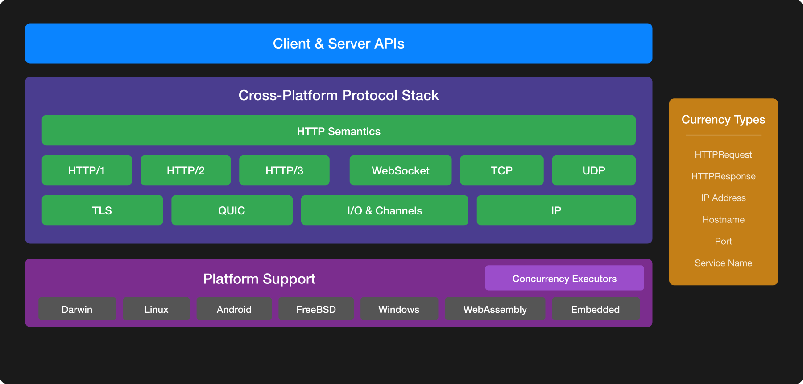

#  A Vision for Networking in Swift

## Introduction

Almost every Swift application touches a network, yet Swift developers face a fragmented landscape of overlapping solutions with no clear guidance on which to choose.

Today, Swift offers multiple networking APIs with overlapping capabilities. Developers who aren't networking experts must determine which tools fit their problem, often with minimal guidance. A suboptimal choice leads to platform-support gaps, missing features, and costly rewrites.

Meanwhile, Swift itself has evolved significantly. The introduction of Swift Concurrency, featuring async/await, structured concurrency, actors, Sendable, and non-copyable types, has transformed how we write asynchronous and performant code. These modern language features open new possibilities for networking APIs: natural expression of asynchronous I/O, safer concurrent access to network resources, and clearer lifecycle management for connections and streams. However, most existing networking APIs predate these capabilities, built around completion handlers, delegates, or reactive patterns that don't leverage Swift's modern strengths.

This vision is intended to span all of Swift's supported platforms, including Apple platforms (iOS, iPadOS, macOS, watchOS, tvOS, and visionOS), Linux, Android, FreeBSD, Windows, WebAssembly, and embedded Swift. Networking is fundamental across all of these environments, and the improvements described here are designed to work everywhere Swift does.

This document proposes a vision for networking in Swift that addresses fragmentation and embraces modern Swift. We outline goals, describe design considerations that guide the solution space, and present an approach.

## Goals

* **High-level and safe by default.** Most developers should use network clients and servers without worrying about underlying complexity. Structured concurrency is the natural programming model by design, secure defaults require no configuration, and disabling safeguards for advanced use cases must be possible but explicit.
* **Modular and interoperable.** Currency types enable libraries to interoperate without coupling to specific implementations. Network protocols and I/O backends should be independently replaceable, with platform-specific complexity pushed to lower layers.
* **Excellent everywhere.** Cross-platform code should work transparently across diverse environments with minimal latency and maximum throughput: from servers handling millions of concurrent connections to memory-constrained embedded runtimes, to devices optimizing for power, to Wasm in browsers and plugins. The same abstractions should enable customisations to leverage the unique characteristics of each environment while retaining a common programming model.
* **Integrated and observable.** Observability via logging, metrics, tracing, and protocol-level diagnostics, should be available at all layers. Users of existing solutions have clear migration paths, and other elements of the ecosystem like Swift Configuration and Swift Service Lifecycle integrate well.

## Design Considerations

Our goal is a foundation that is both powerful and approachable. The following principles guide our approach:

### Progressive API Design

APIs should offer "careful hole-punching": well-defined customization points that don't expose unnecessary complexity. Simple operations stay simple with intuitive defaults and minimal boilerplate, while advanced capabilities become available as needed without forcing developers off a cliff when requirements grow.

High-level APIs handle common tasks at the usage site; complex specialization happens at configuration time. We prefer compile-time enforcement over runtime checks, and minimize implicit interactions that the compiler cannot validate.

Abstractions should not completely obscure the underlying reality though. Developers must be able to understand, debug, and reason about network behavior at a lower level when necessary.

### Resilience and Focused Scope

Networks are inherently unreliable. A robust system handles failure gracefully: fail fast, provide immediate feedback, or degrade to a simpler operational state rather than hang or crash.

Our focus is on abstractions and the developer experience atop HTTP. We aim to enable developers to build innovative services with HTTP and Swift, not reinvent the underlying transport mechanisms.

### Extensibility and Modularity

Advanced users need escape hatches. Experts must be able to optimize, integrate specialized protocols, or push boundaries when necessary. Well-defined extension points let them do so while maintaining ease-of-use for the common cases.

The networking stack needs to be modular and configurable. A layered architecture with clear boundaries lets developers customize at the appropriate level: swap an I/O backend, replace a protocol implementation, or extend a client API. Higher level clients and servers should allow developers to choose what protocols and features are used. Importantly, disabling a protocol or feature should, if possible, remove any required code from the binary.

## A Layered Architecture

Today, Swift developers face overlapping solutions at every layer: Network.framework and SwiftNIO for transport, URLSession and AsyncHTTPClient for HTTP clients, multiple competing server implementations, and various WebSocket and streaming libraries. Each combination requires different expertise and offers different trade-offs.

The vision is a coherent architecture where responsibilities are clear and layers compose naturally:

At the foundation, shared I/O primitives and buffer types provide a common vocabulary for how data moves through the system. These types work across platforms and enable libraries to exchange data without conversion overhead.

Above that, common protocol implementations, such as TLS, HTTP/1.1, HTTP/2, HTTP/3, QUIC, and WebSockets, can be shared rather than reimplemented by each framework. A single, well-tested HTTP/3 implementation benefits every client and server that uses it.

At the top, client and server APIs offer the ergonomic interfaces most developers interact with. These APIs leverage the layers below, focusing on adding value to the developer experience rather than reimplementing protocol mechanics.

Each layer has well-defined boundaries, allowing implementations to be swapped or optimized independently. A server framework can adopt a new HTTP/3 implementation without rewriting its routing layer. A client library can switch I/O backends for different platforms without changing its public API.

This doesn't mean a single implementation for everything. Platform-specific optimizations remain valuable, and different deployment contexts have different needs. Rather, the goal is clear layering with shared abstractions, so effort compounds across the ecosystem instead of fragmenting it.

The sections that follow detail work at each layer, starting with HTTP where developer impact is highest.

## Focus Areas

We propose three initial areas of focus:

1. **Evolve HTTP APIs.** HTTP is the most common networking entry point in Swift; improving it yields the highest impact.
2. **Define currency types.** Shared foundational types enable interoperability and ecosystem-wide innovation.
3. **Define a unified networking stack.** Establish a coherent layered architecture: shared I/O primitives and buffer types at the foundation, common protocol implementations for TLS, HTTP, and other protocols in the middle, and ergonomic client and server APIs at the top.

### HTTP APIs

HTTP is the primary way most Swift developers interact with networking. Whether building iOS applications, server-side services, or cross-platform tools, HTTP serves as the foundational application-layer protocol that powers modern networked applications. Recognizing this central role, our strategy’s immediate focus involves first revisiting the existing Swift’s HTTP APIs, both client and server, to create a modern, unified foundation.

#### A New HTTP Client

We're designing a unified HTTP API that embraces modern Swift. The API is Swift-first: structured concurrency and async/await throughout, with no choosing between completion handlers, delegates, or Combine. Unlike URLSession's fragmented programming models, a single consistent interface scales from simple requests to advanced scenarios.

The design philosophy centers on progressive disclosure. Basic requests with redirects, authentication, cookies, and caching require minimal code. The same API supports bidirectional streaming, HTTP trailers, resumable uploads, and detailed metrics. As requirements evolve from simple to sophisticated, the transition is natural and incremental.

This serves app developers, library authors, and server-side Swift equally. Library developers can avoid platform-specific dependencies while accessing the full power of HTTP. Server-side developers get feature parity with client contexts. The API works on iOS, macOS, Linux, and beyond; the surface is consistent across platforms, though implementations may vary initially and converge over time.

#### A New HTTP Server

Developers working directly with HTTP protocols—such as those building proxies, API gateways, or HTTP-based infrastructure—face an awkward choice today: adopt a web framework like Vapor or Hummingbird that's designed around different concerns, or use SwiftNIO's lower-level APIs that require deep networking expertise. Neither serves these HTTP-protocol-focused use cases well.

Moreover, these existing frameworks each maintain separate HTTP implementations, leading to duplicated effort, inconsistent structured concurrency support, varying behaviour around streaming and request lifecycle, and difficulty sharing middleware without common abstractions.

We're designing an HTTP server API as a structured concurrency-first foundation. It offers bidirectional streaming from the ground up, ensuring HTTP trailers, chunked encoding, and request/response streaming work consistently. Structured resource management ensures connections, requests, and responses are properly handled throughout their lifecycle. Async/await is the natural model, not an adapter bolted on.

Frameworks can build on this foundation and focus on their differentiators: routing, templating, ORM integration. Developers with straightforward needs could get appropriate abstraction without unnecessary complexity.

### Core Primitives

Core primitives provide currency types that let platform complexity move lower in the stack, freeing higher layers to add value rather than reimplement basics. Without them, each library defines its own incompatible versions of fundamental types, duplicating effort and creating integration friction. Currency types provide a shared vocabulary for natural interoperability. Effective currency types are minimal, representing exactly what they model. They align with relevant standards and convert easily to platform-native representations when needed.

Many networking primitives are standards-based and platform-independent, for example IP addresses, hostnames, ports, and Bonjour service names. These are natural value types; Swift's value semantics make them cheap to copy and easy to reason about.

The [swift-http-types](https://github.com/apple/swift-http-types) package already defines `HTTPRequest` and `HTTPResponse` as currency types. A request built for one client works with another and middleware operates generically across implementations. This pattern should extend to other protocols and lower-level primitives.

### Shared Concrete Implementations

The layered architecture enables sharing at each level. When multiple libraries each implement HTTP/1.1, HTTP/2, HTTP/3, QUIC, TLS, or WebSockets, effort is duplicated and bugs are fixed independently. With shared protocol implementations in the middle layer, improvements benefit everyone at once.

Shared implementations also mean common use cases work out of the box. Developers should make requests or serve responses without extensive configuration or deep protocol knowledge. Sensible defaults and proper security should be the starting point.

This frees library authors to focus on differentiation at the layer where they add value. A web framework differentiates through routing and ergonomics, not its HTTP/2 flow-control implementation. An API client differentiates through interface design, not header field parsing. By sharing foundational and protocol layers, higher-level components compete on design philosophy rather than duplicating infrastructure.

We're starting with HTTP client and server implementations for every Swift platform. These implementations are pluggable, allowing alternative transports where appropriate, and extensible for advanced use cases. Most importantly, they work immediately for the common case; no assembly required before writing application code.

Over time, this effort includes gradual unification across Network.framework and SwiftNIO at the foundational layer, bringing together I/O primitives, buffer representations, and how messages pass between protocols into a coherent model for the ecosystem.

## FAQs

**Is the long-term vision to phase out SwiftNIO?**

No. We're unifying the underlying primitives across SwiftNIO, Network.framework, URLSession, and others to reduce duplication and increase cross-platform consistency.

**Will Network.framework and SwiftNIO converge?**

Yes. The proposal is that, over time, both will be replaced by a new unified networking stack, where NIO and Network.framework, become, if anything, a smaller implementation detail for cross-platform support.

**Will the proposed changes be backward compatible?**

Existing libraries and frameworks can adopt the new types incrementally. For example, URLSession already supports `HTTPRequest` and `HTTPResponse` alongside `URLRequest` and `URLResponse`.

**What’s the expected timeline to fully realise this vision?**

This is a multi-year effort. We'll deliver incremental improvements, starting with HTTP APIs, rather than a single large release. Specific timelines will accompany individual proposals as they're evolved with the community.
